# Legacy entity inventory

Data-side discovery for the MongoDB → PostgreSQL/Prisma feature-parity
milestone. Read-only analysis; nothing here changed the legacy database or the
legacy application.

**Source of evidence:** a restored copy of the legacy database (`fastehr`) in the
local `mongo` container, introspected on 2026-08-20. The most recent timestamp
anywhere in the data is `2026-04-16` (`texts.timestamp`, `refillrequests.created`),
so this copy is roughly four months stale relative to today.

---

## ⚠️ Read this before using the document

### The legacy application source is not available

The task assumed the legacy source is in this repository. It is not, and it is
not anywhere on this machine. Verified:

```bash
# only match in the whole repo is a doc; no models, no DAOs, no query call sites
grep -rIl --exclude-dir=node_modules --exclude-dir=.git -iE 'mongo|mongoose' .
#   -> docs/legacy-data-mapping.md

# nothing on disk defines or references these collections
grep -rIl --exclude-dir=node_modules --exclude-dir=.git --exclude-dir=.next \
  -E 'startmytreatments|doserecords|refillrequests|basecoupons' /home/mauricio
#   -> (only this session's own transcript)
```

`apps/web` is the new FastEHR mockup and reads `src/lib/mock-data.ts`; it has no
connection to the legacy schema.

**Consequence.** The discovery method calls for the data to give shape and the
code to give meaning. Only the shape half could be executed. Therefore:

- Every **Purpose** and **Owning module** below is `UNKNOWN`, per the evidence
  rules. They are not guessed from collection names.
- Relationships enforced *only* in application code cannot be enumerated
  exhaustively. What is listed is what the data itself reveals — ObjectId
  fields, shared keys, and index shapes that betray an intended join.
- The "no code references" half of the dead-field test could not be applied.
  Dead-field claims below rest on data evidence alone and are labelled as such.

Everything in sections 1–5 that *is* asserted comes from a query that is quoted
inline. Section 6 is a proposal and is labelled as one.

> **Companion document.** [`document-formats.md`](./document-formats.md) takes
> the next step: it groups every document by its exact key signature to establish
> the *shape* of each entity (`patients` has 1,829 distinct shapes, `visits` 927),
> and derives the PostgreSQL 17 relational decomposition from those shapes. It
> revises three of the modelling choices proposed in §6 below.

### On the introspection script

`inventory.js` was not provided either, so it was written for this task. It was
deliberately kept **out of this repository**: `docs/legacy-data-mapping.md`
states that no MongoDB driver or extraction code enters this repo, "not as a
dependency, not as a script, not 'temporarily'". It lives in the session
scratchpad and was copied into the container to run. The queries that back
specific claims are reproduced inline below so the findings stay reproducible
without shipping the script.

Method: collections at or below 60,000 documents were scanned in full;
`visits` (197,441) and `texts` (869,463) were profiled from a 40,000-document
`$sample`. Presence percentages for those two are estimates and are marked
`~`. All counts used in the quality register were re-run against the **full**
collection, not the sample.

### Redaction

Per the task constraints this document contains field names, types, counts and
code-like value sets only. Several low-cardinality fields turned out to hold
personal data rather than codes — staff names, staff email addresses, DEA
registration numbers, IP addresses, patient-derived filenames, phone numbers,
and a payment merchant identifier. Those fields are **named** below with their
cardinality, and their values are **omitted**.

---

## 1. Summary

| | |
| --- | --- |
| Collections | 18 (15 populated, 3 empty) |
| Documents | 1,155,501 |
| Logical size | 704.2 MiB |
| Storage size (compressed) | 196.5 MiB |
| Index size | 38.5 MiB |

Two collections hold 92% of the documents (`texts` 869,463; `visits` 197,441)
and two hold 90% of the logical bytes (`texts` 322.7 MiB; `visits` 309.9 MiB).

### Findings that most affect migration planning

**1. Unprotected cardholder data is stored in two collections.** Card numbers
are plaintext digit strings, not tokens, not ciphertext, not masked — and the
card security code is stored alongside them.

| Field | Docs holding an all-digit value | Shape |
| --- | --- | --- |
| `refillrequests.creditCardNumber` | 18,070 of 18,073 (99.98%) | 18,040 are exactly 16 digits |
| `refillrequests.creditCardCVV` | 18,071 of 18,073 (99.99%) | 18,020 are exactly 3 digits |
| `patients.creditCardNumber` | 6,401 of 15,613 (41.0%) | 6,296 are exactly 16 digits |
| `patients.creditCardCVV` | 2,838 of 15,613 (18.2%) | 2,824 are exactly 3 digits |

That is 24,471 stored card numbers and 20,909 stored security codes. The
character-class profile shows no masking character and no base64/hex encoding,
which is what a token or ciphertext would look like. This is a factual
observation about the data; the obligations that attach to it are a question
for stakeholders (§7), not something this document infers.

**2. Roughly a fifth of clinical signatures point at users who no longer
exist.** `visits.signature.user` is orphaned in 38,047 of 175,415 signed visits
(21.69%), across 22 distinct missing user ids. The `users` collection holds only
31 documents. Attribution for those visits cannot be reconstructed from this
database — a migration that adds a real foreign key will reject them.

**3. `visits` is a 215-field document with the drug list encoded as object
keys.** `medications` is an object whose *keys* are drug names (31 distinct:
`phentermine`, `tirzepatide`, `botox`, `sauna`, …). Five of those keys are
present on all 197,441 visits whether used or not — `brontrilext` carries a
dosage on 771 documents (0.4%) yet occupies a sub-object on every one. Adding a
drug in the legacy system meant changing the document shape. This is the single
largest modelling decision in the migration (§6).

**4. Patient identity is duplicated and inconsistent, and one third of refill
requests are unlinked.** `dob` (Date) and `dobStr` (String) disagree on the
calendar day for 2,357 of 14,285 patients; 6,043 of 18,073 refill requests have
no `patient` reference and 2,356 of those cannot be matched back to a patient by
name and date of birth.

---

## 2. Entity catalogue

Ordered by document count. **Purpose** and **Owning module** are `UNKNOWN` for
every collection for the reason given above; the resolution is the same in each
case and is stated once here rather than repeated in full: *supply the legacy
application source, or a stakeholder walkthrough of the module that writes the
collection.*

Field tables list the structurally significant fields. For the two wide
collections the full path list (215 and 10 paths) is longer than is useful in
prose; the omitted paths are the per-drug `medications.<drug>.{amount,price}`
leaves, which follow one uniform pattern documented under `visits`.

---

### `texts`

- **Documents:** 869,463 · **Logical:** 322.72 MiB · **Storage:** 66.66 MiB · **Indexes:** 2 (2.7 MiB)
- **Purpose:** `UNKNOWN` — SMS-shaped records (direction, body, timestamp,
  recipient). What sends them, and whether they are transactional or marketing,
  is not determinable from data alone. *Resolution: legacy source, or the
  owner of the SMS integration.*
- **Owning module:** `UNKNOWN` — no application source available.

| Path | Type(s) | Presence | Notes |
| --- | --- | --- | --- |
| `_id` | objectId | 100% | |
| `message` | string | 100% | free text; **not sampled for content** |
| `read` | bool | 100% | see quality note below |
| `timestamp` | date | 100% | ranges 2016-12-02 → 2026-04-16 |
| `to` | string | 100% | phone number — **values omitted** |
| `type` | string | 100% | `inbound` \| `outbound` |
| `patient` | objectId | ~99.98% | 194 docs have none (full-collection count) |
| `from` | string | ~99.47% | phone number — **values omitted** |
| `nexmoId` | string | ~2.71% | present on exactly the 26,823 inbound docs |
| `__v` | int | 100% | Mongoose version key, always `0` |

**Relationships**

- **out:** `patient` → `patients._id`. Many-to-one. Enforced by: **nothing** in
  the database (no constraint); an index `patient_1_timestamp_1` exists for
  lookup but does not enforce. 46 of 869,269 references (0.005%) point at a
  patient that does not exist; 194 documents carry no reference at all.

**Encoded values without a lookup table**

- `type`: `inbound` (26,823) / `outbound` (842,640). Self-describing.

**Quality issues**

- `read` is meaningful for inbound only. 454,956 of 842,640 outbound messages
  (54.0%) are `read: false`, versus 5 of 26,823 inbound. *Inference: the flag
  tracks staff triage of incoming messages and is simply never set on outgoing
  ones — marked as an inference; the code would confirm.*
- `nexmoId` correlates exactly with `type: inbound` (26,823 = 26,823). *Inference:
  it is the upstream provider's message id, captured only on receipt.*

```js
db.texts.countDocuments({ type: 'outbound', read: false })   // 454956
db.texts.countDocuments({ nexmoId: { $exists: true, $ne: null } })  // 26823
```

---

### `visits`

- **Documents:** 197,441 · **Logical:** 309.87 MiB · **Storage:** 104.48 MiB · **Indexes:** 4 (13.5 MiB)
- **Field paths:** 215
- **Purpose:** `UNKNOWN` — the document carries clinical observations, a
  dispensed-item list, pricing, a signature block and card-processor responses
  together. Whether it is a clinical encounter record, a billing record, or
  both, is exactly the kind of question the code would answer and the data
  cannot. *Resolution: legacy source.*
- **Owning module:** `UNKNOWN` — no application source available.

| Path | Type(s) | Presence | Notes |
| --- | --- | --- | --- |
| `_id` | objectId | 100% | |
| `patient` | objectId | 100% | indexed; 1 orphan in 197,441 |
| `created` | date | 100% | indexed; **12 docs before 2000, 1 after 2027** |
| `deleted` | bool | 100% | soft delete; `true` on 2,282 (1.16%) |
| `seen` | bool | 100% | indexed; `false` on 2,421 (1.23%) |
| `digitalSignature` | string | 100% | free text — **values omitted** |
| `medications` | object | 100% | 31 distinct keys; see below |
| `medications.<drug>.amount` | int, double | varies | dosage/quantity |
| `medications.<drug>.price` | int, double | varies | mixed int/double |
| `medications.<drug>.productId` | string | ~100% on 5 drugs | NDC-style code |
| `medications.<drug>.rxNumber` | objectId | ~100% on 5 drugs | **repurposed — see §5** |
| `office` | string | ~99.99% | 6 values + 2 docs holding the literal string `"null"` |
| `bmi` | double, int, null | ~97.52% | |
| `weight` | double, int, null | ~97.52% | mixed numeric types |
| `notes` | string | ~97.23% | clinical free text — **content not sampled** |
| `paid` / `paidDate` | bool / date, null | ~95.2% | |
| `signature` | object | ~95.10% | `{dea, firstName, lastName, signed, ip, user}` |
| `signature.dea` | string | ~95.10% | prescriber DEA — **values omitted** |
| `signature.ip` | string, null | ~88.76% | IP address — **values omitted** |
| `signature.user` | objectId | ~88.76% | **21.69% orphaned** |
| `total` / `subtotal` | int, double, null | ~93% / ~86.6% | mixed numeric types |
| `addenda[]` | array of object | ~93.66% present | non-empty on 4,765 of 184,943 (2.6%) |
| `bloodPressure.systolic` | int, null | ~79.25% | null in 19,562 of 31,703 sampled |
| `bloodPressure.diastolic` | int, null | ~79.20% | null in 19,572 of 31,703 sampled |
| `paymentMethod` | string | ~63.63% | `""`, `cash`, `credit`, `split`, `terminal` |
| `phoneVisit`, `phoneVisitClosed` | bool | ~60.23% | |
| `creditPaymentDetails[]` | array of object | ~51.90% | processor responses; non-empty on ~27.8% |
| `reported` | date | ~48.29% | |
| `noShow` | bool | 73,866 docs | **`true` on 5** — see §5 |
| `welcomePackage` | bool | 73,866 docs | **`true` on 0** — see §5 |
| `additionalFiles[]` | array | 65,421 docs | non-empty on 121 (0.18%) |
| `syringes[]` | array | 31,642 docs | non-empty on 209 (0.66%) |
| `fee`, `discount`, `coupon`, `programFee` | object, null | 19.3% / 13.2% / 0.31% / 0.15% | money sub-objects |
| `coupon.couponId` | string | 645 docs | **string, not objectId** — 632 valid, 13 empty |
| `trackingNumber` | string | ~6.25% | |
| `attachedPhoto`, `chartPhoto` | string | ~1.57% / ~0.57% | filename/extension |
| `reviewSignature` | object | ~0.91% | second-signer block; 0 orphans |
| `splitCash`, `splitCredit` | int, double, null | ~1.30% | |

**The `medications` object.** 31 keys observed across all 197,441 documents.
Five are present on every document regardless of use:

| Key | Documents with the key | Documents with a dosage | Ratio |
| --- | --- | --- | --- |
| `phentermine` | 197,441 | 156,700 | 79.4% |
| `tenuate` | 197,441 | 3,823 | 1.9% |
| `brontril` | 197,441 | 2,824 | 1.4% |
| `tenuateext` | 197,441 | 2,287 | 1.2% |
| `brontrilext` | 197,441 | 771 | 0.4% |
| `liposhot` | 50,466 | 38,023 | 75.3% |
| `b12` | 14,022 | 1,423 | 10.1% |
| `ranitidine` | 12,799 | 370 | 2.9% |
| …24 further keys | ≤ 4,749 each | ≤ 4,521 each | |

```js
db.visits.aggregate([
  { $project: { k: { $objectToArray: '$medications' } } },
  { $unwind: '$k' },
  { $group: { _id: '$k.k', docs: { $sum: 1 },
              withAmount: { $sum: { $cond: [{ $gt: ['$k.v.amount', null] }, 1, 0] } } } },
  { $sort: { withAmount: -1 } },
])
```

**Relationships**

| Direction | Field | Target | Cardinality | Enforcement |
| --- | --- | --- | --- | --- |
| out | `patient` | `patients._id` | many-to-one | index only (`patient_1`); 1 orphan |
| out | `signature.user` | `users._id` | many-to-one | none; **38,047 orphans (21.69%)** |
| out | `reviewSignature.user` | `users._id` | many-to-one | none; 0 orphans of 1,945 |
| out | `coupon.couponId` | `coupons._id` | many-to-one | none; **stored as a string**; 632 resolve, 13 empty |
| in | `patients.visits[]` | — | one-to-many, duplicated | none; see §5 |
| out | `medications.<drug>.rxNumber` | **nothing** | — | see §5 |

**Encoded values without a lookup table**

- `creditPaymentDetails[].rspCode` — 18 values (`00`, `05`, `10`, `12`, `14`,
  `15`, `41`, `43`, `46`, `51`, `54`, `57`, `59`, `61`, `62`, `63`, `91`, `92`).
  **Meaning is available in the data itself**: the sibling field `rspCodeMsg`
  carries the text (`Approved or completed successfully`, `Do not honor`,
  `Expired card`, …). No external lookup needed.
- `creditPaymentDetails[].extRspCode` — 4 values (`B40F`, `B40P`, `B40S`,
  `B40V`), likewise paired with `extRspCodeMsg`.
- `creditPaymentDetails[].cardType` — 4 values (`0`, `1`, `2`, `3`).
  **No lookup anywhere in the data.** `UNKNOWN` — resolution: legacy source or
  the processor's integration guide.
- `creditPaymentDetails[].authRsp.avsRslt` — 9 values (`A`, `G`, `N`, `R`, `S`,
  `U`, `W`, `Y`, `Z`). No lookup in the data. `UNKNOWN` — same resolution.
- `creditPaymentDetails[].authRsp.secRslt` — 3 values (`M`, `N`, `P`). No lookup
  in the data. `UNKNOWN`.
- `creditPaymentDetails[].authRsp.aci` — 3 values (`K`, `N`, `Y`). `UNKNOWN`.
- `creditPaymentDetails[].additionalAmount[].amountType` — 4 values (`01`, `02`,
  `53`, `57`); `accountType` — 3 values (`00`, `20`, `30`); `amountSign` — `C` /
  `D`; `currencyCode` — one value (`840`). `UNKNOWN` except `currencyCode`,
  which is the ISO 4217 numeric code for USD.
- `creditPaymentDetails[].mapCaid` — a single constant merchant identifier.
  **Value omitted** (payment credential).
- `fee.name` — 9 values, self-describing (`first visit`, `deposit`, `mail`, …).
- `discount.name` — 14 values, self-describing.
- `office` — `Sylmar` (101,283), `PennProgram` (56,041), `Telemedicine`
  (23,994), `Montebello` (13,136), `At Home` (2,948), `Israel` (7),
  `Colonial Heights` (4), plus 26 null and 2 literal `"null"`.

**Quality issues**

- 12 documents have `created` before the year 2000 (minimum observed:
  `0201-07-13`) and 1 after 2027 (`2107-12-06`).
- `office` is a free string with a literal `"null"` in 2 documents.
- `weight`, `bmi`, `total`, `subtotal`, `price` mix `int` and `double`.
- `bloodPressure` is present as an object on ~79% of visits but the readings
  inside are null about 62% of the time.

---

### `patients`

- **Documents:** 15,613 · **Logical:** 41.94 MiB · **Storage:** 17.48 MiB · **Indexes:** 4 (2.0 MiB)
- **Field paths:** 99
- **Purpose:** `UNKNOWN` — the document mixes demographics, contact-permission
  flags, stored card details, consent/waiver records, a call log and a
  denormalised visit list. *Resolution: legacy source.*
- **Owning module:** `UNKNOWN` — no application source available.

| Path | Type(s) | Presence | Notes |
| --- | --- | --- | --- |
| `_id` | objectId | 100% | |
| `firstName`, `lastName` | string | 100% | identifying — **values omitted** |
| `dobStr` | string | 100% | 15,488 ISO; 122 full ISO datetimes; 3 other shapes |
| `dob` | date, null | 95.12% | null/missing on 1,328 |
| `address.{street,city,state}` | string | 100% | identifying — **values omitted** |
| `address.zip` | string | 99.99% | |
| `status` | string | 100% | `active` \| `inactive` |
| `visits[]` | array of objectId | 100% | 197,752 entries; **duplicates `visits.patient`** |
| `callLog[]` | array of object | 100% | non-empty on 5,852 (37.5%) |
| `callLog[].user` | string | — | 14 distinct **staff names — values omitted** |
| `callLog[].resolution` | string | — | 7 values, self-describing |
| `referrals[]` | array of object | 100% | non-empty on 2,504 (16.0%) |
| `gender` | string | 99.99% | `female` \| `male` \| `undisclosed` |
| `recentVisit` | date | 98.87% | derived/cached value |
| `height` | int, double, null | 98.39% | mixed numeric types |
| `language` | string | 96.65% | `english` \| `spanish` |
| `phone.number` | int, long, null | 94.21% | **numeric** — see quality |
| `phone.permission` | bool | 82.70% | contact consent |
| `office` | string | 93.27% | 8 values incl. `""`; 1,050 docs have none |
| `referralSource` | string | 72.70% | 17 free-text values incl. `""` |
| `hx` | string | 71.29% | clinical free text — **content not sampled** |
| `recentText` | date | 70.14% | derived/cached value |
| `referredByPt` | objectId, null | 58.63% | 3,778 non-null; 3 orphans |
| `creditCardNumber` | string | 53.64% | **6,401 all-digit values; plaintext**; 1,973 empty strings |
| `creditCardExpMonth` | string | 53.63% | **unpadded and padded mixed**: `1`…`12` and `01`…`09` |
| `creditCardExpYear` | string | 53.62% | 4-digit and 2-digit mixed (`2024` and `24`) |
| `creditCardZip` | string | 53.53% | 5,485 all-digit values; 2,872 empty strings |
| `creditCardCVV` | string | 46.72% | **2,838 all-digit values; plaintext**; 4,457 empty strings |
| `treatmentConsent{DateStr,Msg,Signature}` | string | 48.79% | |
| `healthyWeight` | int, double, null | 46.90% | |
| `email` | string | 46.38% | identifying — **values omitted** |
| `preferredContactTime` | string | 45.19% | **case-inconsistent**: `Morning` and `morning` both present |
| `smsId` | string | 42.27% | 6,599 distinct; join key for `surveys` |
| `ozempicWaiver` | bool | 41.31% | `true` on 18 |
| `semaglutideWaiver` | bool | 36.48% | `true` on 276 |
| `tirzepatideWaiver` | bool | 28.12% | `true` on 388 |
| `atHomeGLP1Waiver` | bool | 3.77% | `true` on 38 |
| `cellumaWaiver` | bool | 6.42% | `true` on 1 |
| `botoxConsent` | bool | 34.91% | |
| `callAfter` | date | 36.19% | |
| `isAtHome` | bool | 36.12% | |
| `programType` | string | 32.84% | 8 values incl. `""`, `None`, `Not Sure` |
| `cutoffDate` | date, null | 32.71% | 541 non-null |
| `programPrice` | int, null | 32.71% | **7 non-null of 5,107** |
| `registered` | date | 29.99% | earliest 2024-06-26 — see quality |
| `liposhotConsent` | bool | 3,173 docs | **`false` on 0** — see §5 |
| `lastVideoSent` | int | 2,960 docs | **always `1`** — see §5 |
| `atHomeChargeDates[]` | array | 1,221 docs | **non-empty on 0** — see §5 |
| `<waiver>{Date,Msg,Signature}` | string | ≤2.49% | one trio per waiver; signature holds a **person name — values omitted** |
| `referringDoctor.{name,email,faxNumber,officeNumber}` | string | 0.04% | 6 docs |
| `testimonialConsent*`, `atHomeContract*`, `botoxConsent*` | bool/string | ≤1.45% | |

**Relationships**

| Direction | Field | Target | Cardinality | Enforcement |
| --- | --- | --- | --- | --- |
| out | `visits[]` | `visits._id` | one-to-many | none; 330 dangling, 19 visits unlisted |
| out | `referredByPt` | `patients._id` | self-reference, many-to-one | none; 3 orphans of 3,778 |
| out | `referrals[].patient` | `patients._id` | one-to-many | none; mirror of `referredByPt` |
| in | `visits.patient` | — | one-to-many | index only |
| in | `texts.patient` | — | one-to-many | index only |
| in | `coupons.patient` | — | one-to-many | none |
| in | `refillrequests.patient` | — | one-to-many | none; 33.4% unlinked |
| in | `appointments.patient` | — | one-to-many | none |
| in | `vials.ownerPatient` | — | one-to-many | index only |
| in | `surveys.smsId` | via `patients.smsId` | one-to-many | none; **string join, not an id** |

**Encoded values without a lookup table**

- `status` (`active`/`inactive`), `gender` (`female`/`male`/`undisclosed`),
  `language` (`english`/`spanish`) — self-describing.
- `office` — 8 values including `""`. Overlaps but is **not identical** to
  `visits.office`: `patients.office` additionally contains `""` and 1,050 nulls.
- `referralSource` — 17 values, free text rather than codes, with near-duplicate
  spellings (`word of mouth` / `word of mount`, `social media` /
  `social media / internet`).
- `programType` — 8 values including `""`, `None`, `Not Sure`, and both
  `Introduction` and `Introductory Program`.
- `lastVideoSent` — integer, only ever `1`. Meaning `UNKNOWN`.

**Quality issues**

- `phone.number` is stored as a **number**, so leading zeros cannot survive.
  14,546 of 14,703 values are 10 digits; the remainder are implausible as phone
  numbers: 87 are a single digit, 1 is 5 digits, 4 are 7, 9 are 8, 17 are 9, and
  19 exceed 11 digits (up to 15). *Inference: the 9-digit values are 10-digit
  numbers whose leading zero was lost to numeric storage — marked as an
  inference; it cannot be confirmed without the source values.*
- 93 groups of patients share `(lastName, firstName, dobStr)`, accounting for 97
  duplicate documents beyond the first in each group.
- `registered` is present on only 29.99% and its earliest value is 2024-06-26,
  while `texts` for patients go back to 2016. *Inference: the field was added
  later and never backfilled.*
- 9 patients have a `dob` before 1900 and 21 after 2015; 56 `dobStr` values have
  an implausible or unparseable year.

```js
db.patients.aggregate([
  { $group: { _id: { l: { $toLower: '$lastName' }, f: { $toLower: '$firstName' }, d: '$dobStr' },
              n: { $sum: 1 } } },
  { $match: { n: { $gt: 1 } } },
  { $group: { _id: null, groups: { $sum: 1 }, extraDocs: { $sum: { $subtract: ['$n', 1] } } } },
])  // -> { groups: 93, extraDocs: 97 }
```

---

### `coupons`

- **Documents:** 39,568 · **Logical:** 6.76 MiB · **Storage:** 1.19 MiB · **Indexes:** 1 (0.4 MiB)
- **Purpose:** `UNKNOWN` — per-patient discount instruments with a validity
  window and a used flag. Whether they are issued automatically or by staff is
  not visible in the data. *Resolution: legacy source.*
- **Owning module:** `UNKNOWN` — no application source available.

| Path | Type(s) | Presence | Notes |
| --- | --- | --- | --- |
| `_id` | objectId | 100% | |
| `patient` | objectId | 100% | 0 orphans |
| `couponDescription` | string | 100% | 8 values, self-describing |
| `discountAmount` | int | 100% | `5`, `10`, `20`, `29` |
| `used` | bool | 100% | |
| `user` | string | 100% | **not a reference** — see §5 |
| `validFrom`, `validTo` | date | 100% | |
| `rules.medsOnly` | bool | 0.60% | 236 docs, always `true` |
| `__v` | int | 100% | always `0` |

**Relationships**

| Direction | Field | Target | Cardinality | Enforcement |
| --- | --- | --- | --- | --- |
| out | `patient` | `patients._id` | many-to-one | none; **0 orphans of 39,568** |
| out | `user` | `users` (by name/email string) | many-to-one | none; string, not an id |
| in | `visits.coupon.couponId` | — | one-to-one-ish | none; only 632 visits reference a coupon |

**Encoded values without a lookup table**

- `couponDescription` — 8 values, self-describing (`10 USD Discount`,
  `Free Injection (B12/Lipoden)`, …).
- `rules.medsOnly` — present only when `true`; absence carries the `false`
  meaning. *Inference.*

**Quality issues**

- `user` holds 21 distinct strings that are a mix of display names (39,044 docs)
  and email addresses (524 docs) for what appears to be the same small staff
  group — the same person occurs in both forms. **Values omitted** (staff
  names and addresses). Reconstructing "who issued this coupon" as a foreign key
  requires a name/email → user mapping that this database does not contain.
- Only 632 of 39,568 coupons (1.6%) are referenced by a visit, yet the `used`
  flag is set far more widely. The redemption path is therefore not fully
  recorded in `visits`. `UNKNOWN` where the rest is recorded — *resolution:
  legacy source.*

```js
// 21 distinct values, 524 containing '@'
db.coupons.distinct('user').length
db.coupons.countDocuments({ user: /@/ })
```

---

### `refillrequests`

- **Documents:** 18,073 · **Logical:** 15.64 MiB · **Storage:** 4.70 MiB · **Indexes:** 2 (1.1 MiB)
- **Purpose:** `UNKNOWN` — a patient-submitted request carrying identity,
  address, card details and a question/answer set. *Resolution: legacy source.*
- **Owning module:** `UNKNOWN` — no application source available.

| Path | Type(s) | Presence | Notes |
| --- | --- | --- | --- |
| `_id` | objectId | 100% | |
| `created` | date | 100% | 2020-03-25 → 2026-04-16 |
| `patient` | objectId, null | 100% present, **66.6% non-null** | 6,043 null |
| `firstName`, `lastName` | string | 100% | identifying — **values omitted** |
| `dob` | **string** | 100% | 12 distinct format shapes — see quality |
| `creditCardNumber` | string | 100% | **plaintext; 18,070 all-digit, 18,040 of them 16 digits** |
| `creditCardCVV` | string | 100% | **plaintext; 18,071 all-digit, 18,020 of them 3 digits** |
| `creditCardExpMonth` | string | 100% | unpadded `1`–`12` |
| `creditCardExpYear` | string | 100% | `2020`–`2038` |
| `creditCardZip` | string | 100% | |
| `qa[]` | array of object | 100% | never empty; avg 3.98 entries |
| `qa[].question` | string | 100% | 8 values, English and Spanish |
| `qa[].answer` | string | 100% | free text — **content not sampled** |
| `status` | string | 100% | `checked` \| `pending` |
| `address.{street,city,state,zip}` | string | 99.02% | identifying — **values omitted** |
| `phone.number` | int | 99.02% | numeric, same caveat as `patients` |
| `phone.permission` | bool | 98.97% | |
| `preferredContactTime` | string | 94.36% | case-inconsistent, same as `patients` |
| `source` | string | 74.20% | `fastehr` \| `hsweb` |
| `attachedPhoto` | string | 18.22% | |
| `requestedMeds[]` | array of object | 12.37% | `{medName, medFreq, supName}`, each with `""` as a value |

**Relationships**

| Direction | Field | Target | Cardinality | Enforcement |
| --- | --- | --- | --- | --- |
| out | `patient` | `patients._id` | many-to-one | none; **6,043 of 18,073 (33.4%) null**; 0 orphans among the rest |
| out (implicit) | `lastName`+`firstName`+`dob` | `patients` | many-to-one | **application-code join**; an index `lastName_1_firstName_1_dob_1` exists on this collection and a matching `lastName_1_firstName_1_dobStr_1` on `patients` |

The implicit join is the only route back to a patient for the 6,043 unlinked
requests. Replaying it against `patients.dobStr`:

| Outcome | Count | Share |
| --- | --- | --- |
| Matches exactly one patient | 3,678 | 60.9% |
| Matches more than one patient (ambiguous) | 9 | 0.1% |
| Matches no patient | 2,356 | 39.0% |

```js
// key patients by lastName|firstName|dobStr, then probe the unlinked requests
db.refillrequests.find({ $or: [{ patient: null }, { patient: { $exists: false } }] })
// -> 6043; matched 3678, ambiguous 9, unmatched 2356
```

**Encoded values without a lookup table**

- `status` (`checked`/`pending`) and `source` (`fastehr`/`hsweb`) —
  self-describing as tokens, but what `checked` gates and what `hsweb` is are
  `UNKNOWN`. *Resolution: legacy source.*
- `qa[].question` — 8 distinct question strings, four English and four Spanish,
  including two near-duplicate English pairs (`…since you last visited the
  clinic?` vs `…since your last visit?`). The questions are stored per document
  rather than referenced, so the wording is versioned only by repetition.
- `requestedMeds[].medName` — 5 values including `""`; `supName` — 4 including
  `""`.

**Quality issues**

- `dob` is a **string** here but a **Date** in `patients`, and it is far less
  regular: 17,981 ISO (`YYYY-MM-DD`), 46 `MM/DD/YYYY`, 24 full ISO datetimes, 10
  `MM/DD/YY`, 4 `M/DD/YY`, 2 `M/DD/YYYY`, 1 `M/D/YY`, 1 `DDD/D/YYYY`, and 4
  free-text month-name forms. Roughly 92 documents (0.5%) will not parse under a
  single format rule.
- Every document carries card data, including the 6,043 that are not linked to
  any patient.

---

### `surveys`

- **Documents:** 9,041 · **Logical:** 1.06 MiB · **Storage:** 0.40 MiB · **Indexes:** 1 (0.1 MiB)
- **Purpose:** `UNKNOWN` — a feedback rating with optional comments and an
  originating IP. *Resolution: legacy source.*
- **Owning module:** `UNKNOWN` — no application source available.

| Path | Type(s) | Presence | Notes |
| --- | --- | --- | --- |
| `_id` | objectId | 100% | |
| `created` | date | 100% | |
| `feedback` | string | 100% | `""`, `good`, `great`, `poor` |
| `ip` | string | 100% | IP address — **values omitted** |
| `comments` | string | 65.81% | free text — **content not sampled** |
| `smsId` | string | 33.71% | the only link to a patient |
| `__v` | int | 100% | always `0` |

**Relationships**

| Direction | Field | Target | Cardinality | Enforcement |
| --- | --- | --- | --- | --- |
| out (implicit) | `smsId` | `patients.smsId` | many-to-one | **application-code join on a shared string**; no index on either side |

There is **no `patient` field at all**. Replaying the join:

| Outcome | Count | Share |
| --- | --- | --- |
| No `smsId` — unlinkable | 6,005 | 66.4% |
| `smsId` matches a patient | 3,033 | 33.5% |
| `smsId` matches no patient | 3 | 0.03% |

**Encoded values without a lookup table**

- `feedback` — 4 values including `""`. Ordinal ordering (`poor` < `good` <
  `great`) is *inferred* from the words themselves, not from anything in the
  data.

**Quality issues**

- Two thirds of all survey responses cannot be attributed to a patient by any
  means available in this database.

---

### `appointments`

- **Documents:** 2,831 · **Logical:** 1.12 MiB · **Storage:** 0.34 MiB · **Indexes:** 1 (0.1 MiB)
- **Purpose:** `UNKNOWN` — scheduled slots with a denormalised copy of patient
  contact details, an optional deposit payment, and a Google Calendar event id.
  *Resolution: legacy source.*
- **Owning module:** `UNKNOWN` — no application source available.

| Path | Type(s) | Presence | Notes |
| --- | --- | --- | --- |
| `_id` | objectId | 100% | |
| `appointmentDate` | date | 100% | 2022-05-10 → 2027-08-27 |
| `created` | date | 100% | |
| `confirmed` | bool | 100% | |
| `patientBasicInfo.{firstName,lastName,email}` | string | 100% | **duplicates `patients`** — see §5 |
| `patientBasicInfo.phoneNumber` | int, long | 100% | numeric; same leading-zero caveat |
| `patientBasicInfo.dobStr` | string | 96.15% | |
| `patientBasicInfo.selectedProgram` | string | 96.15% | 8 values, same set as `patients.programType` |
| `appointmentType` | string | 99.75% | `botox`, `celluma`, `followup`, `glp-1`, `initial`, `other` |
| `patient` | objectId | 93.32% | 189 docs unlinked; 0 orphans |
| `assignedMA.user` | objectId | 93.25% | 2 orphans |
| `googleEventId` | string | 91.13% | external calendar id |
| `depositFee.paid` | bool | 91.10% | |
| `depositFee.codeResult` | string | 3.81% | 10 values, no lookup |
| `depositFee.transaction.*` | string | 3.81% | processor fields |
| `patientMedx.{hxCondition,lastPhExam,meds}` | string | 2.90% | clinical free text |
| `patientMedx.reportedHeight/Weight` | int, double | 2.90% | self-reported; one value is `16` |

**Relationships**

| Direction | Field | Target | Cardinality | Enforcement |
| --- | --- | --- | --- | --- |
| out | `patient` | `patients._id` | many-to-one | none; 189 unlinked (6.7%); 0 orphans |
| out | `assignedMA.user` | `users._id` | many-to-one | none; 2 orphans of 2,640 |
| in | `startmytreatments.appointment` | — | one-to-one | none; **27.8% orphaned** |

**Encoded values without a lookup table**

- `appointmentType` — 6 values, self-describing.
- `depositFee.codeResult` — 10 values (`00`, `03`, `05`, `10`, `14`, `46`, `51`,
  `54`, `57`, `59`). Overlaps the `visits.creditPaymentDetails[].rspCode` set
  but has **no `…Msg` sibling here**, so meaning is `UNKNOWN` in this
  collection. *Inference: same processor code set as `visits`; the `visits`
  `rspCodeMsg` values could serve as the lookup — marked as an inference.*
- `patientBasicInfo.selectedProgram` — 8 values, same set as
  `patients.programType`, including `""`, `None`, `Not Sure`.

**Quality issues**

- `patientBasicInfo` duplicates name, email, phone and DOB that also live on
  `patients`, with no guarantee of agreement (§5).
- 189 appointments (6.7%) have no patient link at all.

---

### `contactrequests`

- **Documents:** 2,206 · **Logical:** 1.24 MiB · **Storage:** 0.36 MiB · **Indexes:** 1 (0.1 MiB)
- **Purpose:** `UNKNOWN` — inbound enquiries with a status, a follow-up note
  trail and a lead-stage marker. *Resolution: legacy source.*
- **Owning module:** `UNKNOWN` — no application source available.

| Path | Type(s) | Presence | Notes |
| --- | --- | --- | --- |
| `_id` | objectId | 100% | |
| `contactName`, `contactEmail`, `phoneNumber` | string | 100% | identifying — **values omitted** |
| `contactStatus` | string | 100% | `new`, `viewed`, `contacted`, `scheduled`, `archived`, `dismissed` |
| `created` | date | 100% | |
| `additionalData[]` | array of object | 100% | note trail; non-empty on 97.1% |
| `additionalData[].user` | string | 97.10% | 14 distinct **staff names — values omitted**; includes a non-person value |
| `additionalData[].noteDate` | **string** | 97.10% | date held as a string |
| `additionalData[].notes` | string | 58.52% | free text |
| `contactMessage` | string | 97.10% | free text |
| `lastFollowUpDate` | date | 97.10% | |
| `originIP` | string | 97.10% | IP address — **values omitted** |
| `leadStatus` | string | 26.43% | `Touch1` … `Touch6` |
| `address.{city,state}` | string | 2.90% | 64 docs; `state` is `CA` or `WA` |
| `contactSource` | string | 2.90% | one value, `contactapp` |

**Relationships**

- **None.** There is no reference to `patients` in either direction, and no
  shared key that would support one. Whether a contact request that converts
  becomes a patient — and how that link is recorded, if at all — is `UNKNOWN`.
  *Resolution: legacy source.*

**Encoded values without a lookup table**

- `contactStatus` — 6 values, self-describing as a workflow.
- `leadStatus` — `Touch1`…`Touch6`. Ordinal; what each touch *is* is `UNKNOWN`.
- `additionalData[].user` — one of the 14 values is not a person name but an
  automation marker. Values omitted; noted because it means this field mixes
  human and system actors in one string column.

**Quality issues**

- `additionalData[].noteDate` is a string while the sibling `lastFollowUpDate`
  is a Date.

---

### `startmytreatments`

- **Documents:** 1,123 · **Logical:** 3.59 MiB · **Storage:** 0.61 MiB · **Indexes:** 1 (0.02 MiB)
- **Purpose:** `UNKNOWN` — a completed intake questionnaire covering
  demographics, medical history, lifestyle, medication and a signed consent.
  *Resolution: legacy source.*
- **Owning module:** `UNKNOWN` — no application source available.

| Path | Type(s) | Presence | Notes |
| --- | --- | --- | --- |
| `_id` | objectId | 100% | |
| `created` | date | 100% | |
| `status` | string | 100% | `new`, `patient`, `removed` |
| `basicDetails.{fullName,email,phoneNumber,streetAddress,cityAddress,stateAddress,zipCode}` | string | 100% | identifying — **values omitted** |
| `basicDetails.gender` | string | 100% | `""`, `female`, `male`, `undisclosed` |
| `basicDetails.dobs` | string | 99.02% | note the plural name; 1,112 ISO, 11 missing |
| `basicDetails.language` | string | 99.02% | `en` \| `es` — **different codes from `patients.language`** |
| `consent.readACK` | bool | 100% | **always `true`** |
| `consent.treatmentConsent{DateStr,Msg,Signature}` | string | 100% | |
| `medicalHistory.{breastfeeding,diabetes,glaucoma,heart,hypertension,kidney,pregnant,thyroid}` | **bool** | 100% | |
| `medicalHistory.hadSurgical` | **string** | 100% | `"0"` \| `"1"` |
| `medicalHistory.explainSurgery` | string | 100% | free text |
| `lifestyle.lifestyle` | string | 100% | `active`, `athletic`, `manual`, `sedentary` |
| `lifestyle.usedDietPills` | **string** | 100% | `"0"` \| `"1"` |
| `lifestyle.{height,weight,weightToLose}` | **string** | 100% | numbers held as strings |
| `lifestyle.explainDietPills` | string | 100% | free text |
| `personalHabits.{drinkWater,eatStress,eatSweets,useDrugs,vegan}` | **string** | 100% | `"0"` \| `"1"` |
| `personalHabits.drinkWine` | **string** | 100% | `""`, `"0"`, `"1"` — three-state |
| `medication.{listMeds,treatmentPhysician}` | string | 100% | free text |
| `additionalInfo` | string | 25.56% | 5 values, self-describing |
| `appointment` | objectId | 13.45% | 151 docs; **42 orphaned (27.8%)** |

**Relationships**

| Direction | Field | Target | Cardinality | Enforcement |
| --- | --- | --- | --- | --- |
| out | `appointment` | `appointments._id` | one-to-one | none; **42 of 151 orphaned (27.8%)** |
| out | *(none to `patients`)* | — | — | no patient reference exists |

`status: "patient"` implies an intake that became a patient, but **no field
records which patient**. Linking intake to patient record is `UNKNOWN` —
*resolution: legacy source, or confirmation that the link was never stored.*

**Encoded values without a lookup table**

- Boolean-ish answers use **three different encodings in one document**: real
  booleans (`medicalHistory.*`), the strings `"0"`/`"1"`
  (`personalHabits.*`, `lifestyle.usedDietPills`, `medicalHistory.hadSurgical`),
  and a three-state `""`/`"0"`/`"1"` (`personalHabits.drinkWine`). Whether `""`
  means "not asked", "skipped" or "no" is `UNKNOWN`.
- `basicDetails.language` uses `en`/`es`; `patients.language` uses
  `english`/`spanish` for the same concept.
- `status` — `new` / `patient` / `removed`, self-describing as a funnel.

**Quality issues**

- `lifestyle.height`, `lifestyle.weight`, `lifestyle.weightToLose` are strings,
  while the comparable `patients.height` is numeric.
- `consent.readACK` is always `true`, so it records nothing (§5).

---

### `prefrences`

- **Documents:** 92 · **Logical:** 0.29 MiB · **Storage:** 0.14 MiB · **Indexes:** 1
- **Note:** the collection name is misspelled in the database ("prefrences").
- **Purpose:** `UNKNOWN` — each document holds a `user` reference and an array of
  `{old, new}` string pairs. *Resolution: legacy source.* The name/shape suggests
  a text-substitution list, but that is precisely the inference the evidence
  rules forbid without code, so it is recorded as `UNKNOWN`.
- **Owning module:** `UNKNOWN` — no application source available.

| Path | Type(s) | Presence | Notes |
| --- | --- | --- | --- |
| `_id` | objectId | 100% | |
| `user` | objectId | 100% | **66.3% orphaned** |
| `corrections[]` | array of object | 100% | 1,380 entries; empty on 21 of 92 |
| `corrections[].old`, `.new` | string | 77.17% | free text — **content not sampled** |
| `__v` | int | 100% | always `0` |

**Relationships**

| Direction | Field | Target | Cardinality | Enforcement |
| --- | --- | --- | --- | --- |
| out | `user` | `users._id` | many-to-one | none; **61 of 92 orphaned (66.3%)**, spanning 61 distinct missing user ids |

**Quality issues**

- Two thirds of these documents belong to users that no longer exist. There are
  92 preference documents for 31 users — more preference records than users.

---

### `users`

- **Documents:** 31 · **Logical:** 0.01 MiB · **Storage:** 0.02 MiB · **Indexes:** 2 (`email` unique)
- **Purpose:** `UNKNOWN` — staff accounts with a credential pair, a role-ish
  `group`, and prescriber attributes. *Resolution: legacy source.*
- **Owning module:** `UNKNOWN` — no application source available.

| Path | Type(s) | Presence | Notes |
| --- | --- | --- | --- |
| `_id` | objectId | 100% | |
| `email` | string | 100% | **unique index**; identifying — **values omitted** |
| `firstName`, `lastName` | string | 100% | identifying — **values omitted** |
| `group` | string | 100% | `admin`, `clerk`, `csr`, `doc` |
| `hash`, `salt` | string | 100% | **credential material — values omitted** |
| `isActive` | bool | 100% | |
| `hasRemote` | bool | 100% | meaning `UNKNOWN` |
| `canPrescribe` | bool | 58.06% | present only when `true` (18 docs) |
| `dea` | string | 51.61% | 16 docs; **DEA registration numbers — values omitted** |
| `reviewer` | bool | 9.68% | present only when `true` (3 docs) |
| `__v` | int | 100% | always `0` |

**Relationships**

| Direction | Field | Target | Cardinality | Enforcement |
| --- | --- | --- | --- | --- |
| in | `visits.signature.user` | — | one-to-many | none; **38,047 orphans** |
| in | `visits.reviewSignature.user` | — | one-to-many | none; 0 orphans |
| in | `appointments.assignedMA.user` | — | one-to-many | none; 2 orphans |
| in | `prefrences.user` | — | one-to-many | none; **61 orphans** |
| in | `vials.registeredBy` | — | one-to-many | index only; 0 orphans |
| in | `coupons.user` | — | one-to-many | **string name/email, not an id** |
| in | `basecoupons.user` | — | one-to-many | **string email, not an id** |

**Encoded values without a lookup table**

- `group` — `admin`, `clerk`, `csr`, `doc`. The tokens are suggestive but the
  permissions each grants are `UNKNOWN`. *Resolution: legacy source.*
- `canPrescribe` and `reviewer` are present only when true; absence encodes
  false. *Inference from the observed value sets — each has exactly one distinct
  value.*

**Quality issues**

- The collection has been pruned: 22 user ids referenced by visit signatures and
  61 referenced by `prefrences` are absent. Only 18 of the 31 surviving users are
  referenced by any visit signature.
- `dea` is stored on `users` **and** copied onto every `visits.signature` and
  `visits.addenda[].signature` (§5).

---

### `medicationtypes`

- **Documents:** 7 · **Storage:** 0.02 MiB · **Indexes:** 3 (`name` unique, `active`)
- **Purpose:** `UNKNOWN` — a catalogue entry with dosage, vial and expiry
  parameters. *Resolution: legacy source.*
- **Owning module:** `UNKNOWN` — no application source available.

| Path | Type(s) | Presence | Notes |
| --- | --- | --- | --- |
| `_id` | objectId | 100% | |
| `name` | string | 100% | **unique index**; 7 values, all compounded tirzepatide/B12 presentations |
| `active` | bool | 100% | indexed; always `true` |
| `mgPerDose` | int, double | 100% | `2.5`, `5`, `7.5`, `10`, `12.5`, `15` |
| `dosesPerVial` | int | 100% | always `4` |
| `expirationDays` | int | 100% | always `28` |
| `borrowingAllowedInLastDays` | int | 100% | always `7`; term meaning `UNKNOWN` |
| `created` | date | 100% | |

**Relationships**

| Direction | Field | Target | Cardinality | Enforcement |
| --- | --- | --- | --- | --- |
| in | `vials.medicationType` | — | one-to-many | none; 0 orphans of 6 |

**Note.** These 7 catalogue rows are **disconnected from `visits.medications`**,
which names drugs as object keys (`tirzepatide`, `tirzemethyl`, `semaglutide`, …)
with no reference to a `medicationtypes._id`. The two drug vocabularies do not
share identifiers.

---

### `vials`

- **Documents:** 6 · **Storage:** 0.02 MiB · **Indexes:** 4
- **Purpose:** `UNKNOWN` — physical stock items with a lot number, location,
  status and remaining dose count. *Resolution: legacy source.*
- **Owning module:** `UNKNOWN` — no application source available.

| Path | Type(s) | Presence | Notes |
| --- | --- | --- | --- |
| `_id` | objectId | 100% | |
| `medicationType` | objectId | 100% | indexed with `status`; 0 orphans |
| `ownerPatient` | objectId | 100% | indexed with `status`; 0 orphans |
| `registeredBy` | objectId | 100% | 0 orphans |
| `lotNumber` | string | 100% | 5 distinct across 6 docs |
| `status` | string | 100% | always `unopened` |
| `remainingDoses` | int | 100% | always `4` |
| `storageLocation` | string | 100% | indexed with `status`; one value |
| `registered` | date | 100% | |
| `expirationDate` | — | **absent** | **indexed but never present** — see §5 |

**Relationships**

| Direction | Field | Target | Cardinality | Enforcement |
| --- | --- | --- | --- | --- |
| out | `medicationType` | `medicationtypes._id` | many-to-one | index only; 0 orphans |
| out | `ownerPatient` | `patients._id` | many-to-one | index only; 0 orphans |
| out | `registeredBy` | `users._id` | many-to-one | none; 0 orphans |
| in | `doserecords.vial` | — | one-to-many | index only; **collection is empty** |

**Quality issues**

- Six documents, all `unopened`, all with 4 doses remaining, one storage
  location, one lot duplicated. *Inference: this is a feature that was built and
  barely used, or test data — the two cannot be distinguished without the code
  or a stakeholder.*
- An index exists on `expirationDate_1_status_1` but **no document has an
  `expirationDate` field**.

---

### `basecoupons`

- **Documents:** 4 · **Storage:** 0.02 MiB · **Indexes:** 1
- **Purpose:** `UNKNOWN` — coupon templates. *Resolution: legacy source.*
- **Owning module:** `UNKNOWN` — no application source available.

| Path | Type(s) | Presence | Notes |
| --- | --- | --- | --- |
| `_id` | objectId | 100% | |
| `couponDescription` | string | 100% | 4 values, a subset of `coupons.couponDescription` |
| `discountAmount` | int | 100% | `5`, `10`, `20` |
| `validTimeframe` | int | 100% | always `2`; **unit is `UNKNOWN`** (days? weeks? months?) |
| `user` | **string** | 100% | one email address — **value omitted** |
| `created` | date | 100% | |

**Relationships**

- **No enforced or ObjectId relationship to `coupons`.** The link is by
  identical `couponDescription` text. *Inference: `basecoupons` are templates
  from which `coupons` rows are created — the shared description strings and the
  shared `discountAmount` values are the only evidence, and neither is a key.*
  `UNKNOWN` whether the application actually copies from these rows.

**Quality issues**

- `user` is a string email here, while the same-named field on `coupons` holds
  display names *and* emails, and on `prefrences` holds an ObjectId (§5).

---

### `excludehours`

- **Documents:** 2 · **Storage:** 0.02 MiB · **Indexes:** 1
- **Purpose:** `UNKNOWN` — named sets of weekday/hour ranges. *Resolution:
  legacy source.*
- **Owning module:** `UNKNOWN` — no application source available.

| Path | Type(s) | Presence | Notes |
| --- | --- | --- | --- |
| `_id` | objectId | 100% | |
| `name` | string | 100% | 2 values, one of which is `None` |
| `exclude[]` | array of object | 100% | empty on 1 of 2 documents |
| `exclude[].day` | int | — | `1`, `3`, `5` |
| `exclude[].startHr`, `.endHr` | int | — | `900`, `1700` — HHMM packed into an integer |

**Relationships**

- **None observed.** Nothing references this collection and it references
  nothing. How it is selected or applied is `UNKNOWN`.

**Encoded values without a lookup table**

- `day` — integers `1`, `3`, `5`. Whether the week starts at 0 or 1, and on
  which day, is `UNKNOWN`. *Do not assume.*
- `startHr`/`endHr` — `900` and `1700` are HHMM as an integer. Timezone is
  `UNKNOWN`.

---

### `appointmentintervals`, `doserecords`, `successstories` — empty

All three hold **0 documents**. They exist with indexes, which is itself
evidence that the application defined them.

| Collection | Documents | Indexes beyond `_id` |
| --- | --- | --- |
| `appointmentintervals` | 0 | none |
| `successstories` | 0 | none |
| `doserecords` | 0 | `patient_1_administrationDate_-1`, `vial_1_administrationDate_-1`, `owedToPatient_1` |

`doserecords` is the informative one: its indexes reveal an intended shape —
fields `patient`, `vial`, `administrationDate` and `owedToPatient` — even
though no document exists to confirm the types. Taken with `vials` (6 rows, all
`unopened`) this is *evidence of an inventory/administration feature that was
built and never populated in this copy* — marked as an inference.

Whether these are unused features, features whose data was purged, or
collections that exist only in this restored copy is `UNKNOWN` — *resolution:
the legacy source, or confirmation of how this dump was produced (§7).*

---

## 3. Relationship map

Nothing in this database enforces referential integrity. MongoDB applies no
foreign-key constraints, and no relationship below is backed by anything
stronger than an index that makes the lookup fast. "Enforcement" therefore reads:

- **none** — no index, no constraint; the join exists only because something
  writes a matching value.
- **index** — an index supports the lookup but does not constrain it. Orphans
  are still possible and, as the numbers show, present.
- **application-code** — the join is not on an id at all; it is on shared
  strings, and only application code knows to perform it. **Unverifiable here**
  because the legacy source is unavailable — these were found by observing
  shared keys and index shapes in the data.

```mermaid
erDiagram
    patients ||--o{ visits : "visits.patient (index)"
    patients ||--o{ texts : "texts.patient (index)"
    patients ||--o{ coupons : "coupons.patient (none)"
    patients ||--o{ refillrequests : "refillrequests.patient (none, 33.4% null)"
    patients ||--o{ appointments : "appointments.patient (none)"
    patients ||--o{ vials : "vials.ownerPatient (index)"
    patients ||--o{ patients : "referredByPt self-ref (none)"
    patients ||--o{ visits : "patients.visits[] DUPLICATE (none)"
    patients ||--o{ surveys : "surveys.smsId to patients.smsId (app-code)"
    patients ||--o{ refillrequests : "name+dob fallback (app-code)"

    users ||--o{ visits : "signature.user (none, 21.7% orphan)"
    users ||--o{ visits : "reviewSignature.user (none)"
    users ||--o{ appointments : "assignedMA.user (none)"
    users ||--o{ prefrences : "prefrences.user (none, 66.3% orphan)"
    users ||--o{ vials : "vials.registeredBy (none)"
    users ||--o{ coupons : "coupons.user STRING name/email (app-code)"
    users ||--o{ basecoupons : "basecoupons.user STRING email (app-code)"

    coupons ||--o{ visits : "visits.coupon.couponId STRING (none)"
    basecoupons ||--o{ coupons : "shared description text only (app-code)"

    medicationtypes ||--o{ vials : "vials.medicationType (index)"
    vials ||--o{ doserecords : "doserecords.vial (index, EMPTY)"
    patients ||--o{ doserecords : "doserecords.patient (index, EMPTY)"

    appointments ||--o| startmytreatments : "startmytreatments.appointment (none, 27.8% orphan)"

    contactrequests {
        none no_relationship_to_any_collection
    }
    excludehours {
        none no_relationship_to_any_collection
    }
    successstories {
        empty zero_documents
    }
    appointmentintervals {
        empty zero_documents
    }
```



| # | Source | Field | Target | Cardinality | Enforcement | Integrity measured |
| --- | --- | --- | --- | --- | --- | --- |
| 1 | `visits` | `patient` | `patients._id` | N:1 | index | 1 orphan / 197,441 (0.001%) |
| 2 | `texts` | `patient` | `patients._id` | N:1 | index | 46 orphans / 869,269 (0.005%); 194 absent |
| 3 | `coupons` | `patient` | `patients._id` | N:1 | none | 0 orphans / 39,568 |
| 4 | `refillrequests` | `patient` | `patients._id` | N:1 | none | 0 orphans / 12,030; **6,043 null (33.4%)** |
| 5 | `refillrequests` | `lastName`+`firstName`+`dob` | `patients` | N:1 | **application-code** | of 6,043: 3,678 unique, 9 ambiguous, **2,356 no match** |
| 6 | `appointments` | `patient` | `patients._id` | N:1 | none | 0 orphans / 2,642; 189 absent (6.7%) |
| 7 | `patients` | `referredByPt` | `patients._id` | N:1 self | none | 3 orphans / 3,778 (0.079%) |
| 8 | `patients` | `referrals[].patient` | `patients._id` | 1:N self | none | mirrors #7; 3,782 entries |
| 9 | `patients` | `visits[]` | `visits._id` | 1:N | none | **330 dangling**; 19 visits unlisted; 0 owner mismatches |
| 10 | `visits` | `signature.user` | `users._id` | N:1 | none | **38,047 orphans / 175,415 (21.69%)**, 22 distinct ids |
| 11 | `visits` | `reviewSignature.user` | `users._id` | N:1 | none | 0 orphans / 1,945 |
| 12 | `visits` | `coupon.couponId` | `coupons._id` | N:1 | none | **string type**; 632 resolve, 13 empty strings |
| 13 | `visits` | `medications.*.rxNumber` | — | — | — | **references nothing** (see §5) |
| 14 | `appointments` | `assignedMA.user` | `users._id` | N:1 | none | 2 orphans / 2,640 (0.076%) |
| 15 | `prefrences` | `user` | `users._id` | N:1 | none | **61 orphans / 92 (66.3%)** |
| 16 | `vials` | `ownerPatient` | `patients._id` | N:1 | index | 0 orphans / 6 |
| 17 | `vials` | `medicationType` | `medicationtypes._id` | N:1 | index | 0 orphans / 6 |
| 18 | `vials` | `registeredBy` | `users._id` | N:1 | none | 0 orphans / 6 |
| 19 | `startmytreatments` | `appointment` | `appointments._id` | 1:1 | none | **42 orphans / 151 (27.8%)** |
| 20 | `surveys` | `smsId` | `patients.smsId` | N:1 | **application-code** | 3,033 match, 3 unmatched, **6,005 have no smsId (66.4%)** |
| 21 | `coupons` | `user` | `users` | N:1 | **application-code** | string name/email; 21 distinct forms for a smaller staff set |
| 22 | `basecoupons` | `user` | `users` | N:1 | **application-code** | string email |
| 23 | `basecoupons` | `couponDescription` | `coupons.couponDescription` | 1:N | **application-code** | text equality only; unverified |
| 24 | `doserecords` | `patient`, `vial`, `owedToPatient` | `patients`, `vials`, `patients` | N:1 | index | **collection empty** |

**Collections with no relationship to anything:** `contactrequests` (2,206
docs), `excludehours` (2), `successstories` (0), `appointmentintervals` (0).

---

## 4. Data quality register

Sorted by migration impact. Every volume figure is a full-collection count.

| # | Issue | Collections affected | Volume | Migration impact | Cleanup effort |
| --- | --- | --- | --- | --- | --- |
| 1 | Card numbers and security codes stored as plaintext digit strings | `refillrequests`, `patients` | 24,471 card numbers; 20,909 security codes | **Blocking.** Determines whether these columns may be migrated at all, and whether the target may store them in any form. Cannot be resolved by engineering alone (§7) | Low to drop; **unknown** to remediate — depends entirely on the policy answer |
| 2 | Clinical signatures reference deleted users | `visits` → `users` | 38,047 of 175,415 signed visits (21.69%), 22 distinct missing ids | **Blocking for a FK.** A real `signedById` foreign key rejects 38,047 rows. Attribution is unrecoverable from this database | High — needs a decision (nullable FK, tombstone users, or drop attribution) plus possible recovery from another source |
| 3 | One third of refill requests are unlinked, and 39% of those are unmatchable | `refillrequests` | 6,043 of 18,073 null (33.4%); 2,356 unmatchable (13.0% of all) | High. These rows carry card data and clinical answers but belong to no patient | High — the 3,678 single-match rows can be auto-linked; the 2,356 need a business rule |
| 4 | `dob` and `dobStr` disagree | `patients` | 2,357 of 14,285 (16.5%): 106 formatting-only, 117 exactly one day apart, **2,134 genuinely different** | High. Date of birth is an identity key and the join key for #3. Picking the wrong column silently corrupts identity | Medium — 223 are mechanical; 2,134 need a source of truth |
| 5 | Drug list encoded as document keys, not rows | `visits` | 31 distinct keys over 197,441 docs; 5 keys present on all 197,441 regardless of use | High. Drives the central schema decision (§6); a naive port produces either 31 sparse columns or an opaque JSON blob | High — the transform is the migration's main body of work |
| 6 | Two thirds of survey responses cannot be attributed to a patient | `surveys` | 6,005 of 9,041 (66.4%) have no `smsId` | Medium. Either migrate unattributed or drop; affects any per-patient feedback feature | Low to decide, none to execute |
| 7 | Phone numbers stored as integers | `patients`, `refillrequests`, `appointments` | 14,703 patient values; 157 implausible (87 single-digit, 17 nine-digit, 19 over 11 digits) | Medium. Leading zeros are unrecoverable; 87 single-digit values are junk | Low — cast to text and quarantine the 157 |
| 8 | Duplicate patient records | `patients` | 93 groups, 97 excess documents (0.6%) | Medium. Merging after migration is harder than before; each has its own visits and cards | Medium — needs a merge rule, likely manual review of 93 groups |
| 9 | `startmytreatments` cannot be linked to the patient it became | `startmytreatments` | 1,123 docs, **0** with a patient reference; `status: patient` exists but names no patient | Medium. Intake history is orphaned from the patient record | High — may be unrecoverable; needs stakeholder input |
| 10 | Staff identity stored as free-text names/emails instead of ids | `coupons`, `basecoupons`, `patients.callLog[]`, `contactrequests.additionalData[]` | 39,568 + 4 + 15,868 callLog entries + 5,694 note entries | Medium. Blocks a real FK to `users`; same person appears in multiple string forms | Medium — needs a name/email → user mapping that does not exist in this database |
| 11 | `refillrequests.dob` has 12 distinct format shapes | `refillrequests` | ~92 of 18,073 non-ISO (0.5%), incl. free-text month names | Medium. Breaks the #3 name+dob join for exactly the rows that need it | Low — a tolerant parser plus manual review of ~92 |
| 12 | `startmytreatments` uses three boolean encodings in one document | `startmytreatments` | 1,123 docs × ~14 fields | Medium. `""` vs `"0"` vs `false` — meaning of `""` is unknown | Low to convert, but needs the `""` question answered first |
| 13 | Corrupt dates | `visits` | 12 docs before 2000 (min year 0201), 1 after 2027 (year 2107) | Low volume, high noise. Will pass a `timestamptz` column and poison any date-range report | Low — quarantine 13 rows |
| 14 | Denormalised `patients.visits[]` disagrees with `visits.patient` | `patients`, `visits` | 330 dangling entries; 19 visits in no array; 0 owner mismatches | Low. The array is redundant and should not be migrated (§5) | Low — drop the array, keep the FK |
| 15 | Mixed `int`/`double` for the same field | `visits` (`weight`, `bmi`, `total`, `subtotal`, `price`, `amount`) | e.g. `weight`: ~20,795 double / ~17,065 int in a 40,000 sample | Low. Prisma needs one type; money as float is its own problem (§6) | Low — cast during import |
| 16 | Case- and spelling-inconsistent categorical strings | `patients` (`preferredContactTime`, `referralSource`, `programType`), `visits` (`office`) | `Morning`/`morning`; 17 referral sources incl. `word of mouth`/`word of mount`; `office` has 2 literal `"null"` | Low. Blocks a clean enum without a mapping table | Low — normalise on import |
| 17 | `patients.registered` never backfilled | `patients` | present on 4,683 of 15,613 (30.0%); earliest 2024-06-26 while texts reach 2016 | Low. Cannot be used as an account-creation date | None — accept as nullable |
| 18 | Index on a field that does not exist | `vials` | `expirationDate_1_status_1` over 6 docs, 0 with the field | Cosmetic. Signals an incomplete feature | None |

---

## 5. Dead, duplicated, and repurposed fields

These are the most contestable claims in the document, so each row carries its
evidence. **Caveat that applies to all three tables:** the standard test for a
dead field is "near-zero presence **and** no code references". The code half
could not be run. Every classification below therefore rests on data evidence
alone, and a field marked dead could still be read by code that simply never
finds a value.

### 5.1 Dead fields

| Field | Evidence | Confidence |
| --- | --- | --- |
| `visits.welcomePackage` | Exists on 73,866 docs; `true` on **0**. `db.visits.countDocuments({welcomePackage:true})` → `0` | High — a boolean that is never true carries no information |
| `visits.noShow` | Exists on 73,866; `true` on **5** (0.007%) | High |
| `patients.atHomeChargeDates` | Array exists on 1,221 docs; **non-empty on 0**. `db.patients.countDocuments({'atHomeChargeDates.0':{$exists:true}})` → `0` | High |
| `patients.lastVideoSent` | Exists on 2,960; value is `1` on all of them; `{$ne:1}` → `0` | High as a *variable*; it may act as a flag. Meaning `UNKNOWN` |
| `patients.liposhotConsent` | Exists on 3,173; `false` on **0** | Medium — same shape as `canPrescribe`/`reviewer`: presence encodes truth. Not dead so much as redundant with the sibling signature fields |
| `startmytreatments.consent.readACK` | 1,123 docs, `true` on all | High — records nothing beyond the document's existence |
| `medicationtypes.active` | 7 docs, `true` on all; **has its own index** | Medium — indexed for a filter that currently excludes nothing |
| `vials.expirationDate` | **Indexed** (`expirationDate_1_status_1`) but present on **0** of 6 documents | High — the index proves intent, the data proves disuse |
| `patients.programPrice` | Present on 5,107 docs but **non-null on 7** (0.14%) | High |
| `visits.additionalFiles` | Array on 65,421; non-empty on **121** (0.18%) | Medium — rarely used, not unused |
| `visits.syringes` (top-level array) | Array on 31,642; non-empty on **209** (0.66%). Note a *separate* `medications.syringes` object exists on 218 docs | Medium — and see 5.2, the concept is stored twice |
| `coupons.rules.medsOnly` | Present on 236 of 39,568 (0.6%); `true` on all | Medium |
| All `__v` | Present on every document of every collection, value `0` except `visits` (`0`–`7`) | High — Mongoose's internal version key; no target-model meaning |

### 5.2 Duplicated fields

| Duplication | Evidence | Notes |
| --- | --- | --- |
| `patients.visits[]` ↔ `visits.patient` | 197,752 array entries vs 197,441 visits. 330 array entries point at a non-existent visit; 19 visits appear in no array; **0 entries are owned by a different patient** | The array is a maintained cache of the FK. It disagrees in 349 places. In the target, the FK alone is authoritative |
| `patients.dob` (Date) ↔ `patients.dobStr` (String) | Both present on 14,285; **2,357 disagree** (106 format-only, 117 one day apart, 2,134 genuinely different). `dobStr` is present on 100% of patients, `dob` on 95.12% | Two columns for one fact, disagreeing 16.5% of the time. The 117 one-day-apart cases are the classic timezone-shifted `@db.Date` bug that [ADR 18](../adr/018-two-test-tiers.md) exists to catch |
| `patients.referredByPt` ↔ `patients.referrals[]` | 3,778 non-null `referredByPt` vs 3,782 `referrals[].patient` entries | The same referral edge stored from both ends; counts differ by 4 |
| `users.dea` ↔ `visits.signature.dea` ↔ `visits.addenda[].signature.dea` | DEA is stored on the user **and copied onto every signature block**; ~95.10% of visits carry `signature.dea` | Defensible as a point-in-time snapshot for a signed clinical record, but it is duplication and the two can drift. 25 distinct DEA values appear in `addenda` signatures vs 16 in `users` — **more DEA values in the copies than in the source**, consistent with the deleted-user finding |
| `visits.signature.{firstName,lastName}` ↔ `users.{firstName,lastName}` | Same shape as the DEA copy | For 38,047 visits the copy is the **only** surviving record of who signed |
| `appointments.patientBasicInfo.*` ↔ `patients.*` | `firstName`, `lastName`, `email`, `phoneNumber`, `dobStr` duplicated on all 2,831 appointments, of which 2,642 also carry a `patient` id | Snapshot vs live record; agreement unverified |
| `refillrequests.{firstName,lastName,dob,address,phone}` ↔ `patients.*` | Duplicated on all 18,073 | Necessary for the 6,043 unlinked rows, redundant for the other 12,030 |
| `visits.syringes[]` ↔ `visits.medications.syringes` | Top-level array non-empty on 209 docs; the `medications.syringes` object on 218 docs | The same concept in two places in one document |
| `patients.programType` ↔ `appointments.patientBasicInfo.selectedProgram` | Identical 8-value set including `""`, `None`, `Not Sure` | Same vocabulary, two homes |
| `patients.recentVisit`, `patients.recentText` | Present on 98.87% / 70.14%; derivable by `MAX()` over `visits` / `texts` | Cached aggregates. In PostgreSQL these are a view or an index-backed query, not columns |
| `coupons.{couponDescription,discountAmount}` ↔ `basecoupons.*` | 4 base rows; their descriptions are a subset of the 8 in `coupons` | Template text copied onto every issued coupon rather than referenced |

### 5.3 Repurposed fields

| Field | Name suggests | Actually holds | Evidence |
| --- | --- | --- | --- |
| `visits.medications.<drug>.rxNumber` | A prescription number | A freshly generated ObjectId that **references nothing** | 982,542 occurrences, **982,542 distinct**, 0 repeats. Checked against every `visits._id` and every `patients._id`: **0 matches**. It is a unique opaque id minted per drug slot per visit, typed ObjectId, named "number" |
| `coupons.user` | A reference to `users` | A free-text string mixing display names (39,044 docs) and email addresses (524 docs) — 21 distinct forms | Same field name is an **ObjectId** on `prefrences` and a **string email** on `basecoupons`. Three types under one name across three collections |
| `basecoupons.user` | A reference to `users` | A single email address string | 4 docs, one value |
| `visits.coupon.couponId` | An ObjectId reference | A **string**, 632 of which are 24-hex and resolve, 13 of which are the empty string | The 13 "orphans" reported by a naive FK check are empty strings, not bad ids — worth stating because a migration will hit them |
| `patients.dobStr` | A date rendered as a string | Mostly `YYYY-MM-DD` (15,488) but **122 are full ISO datetimes** and 3 are other formats | A column that is a date in 99.2% of rows and a timestamp in 0.8% |
| `refillrequests.dob` | A date | A string in 12 distinct shapes including free-text month names | See §4 #11 |
| `contactrequests.additionalData[].noteDate` | A date | A **string**, while its sibling `lastFollowUpDate` is a real Date | Two date representations in one document |
| `texts.read` | "Has this message been read" | Meaningful for inbound only: `false` on 454,956 of 842,640 outbound (54.0%) vs 5 of 26,823 inbound | *Inference*: the flag tracks staff triage of incoming messages; on outbound it is written but never updated. The code would confirm |
| `users.canPrescribe`, `users.reviewer`, `coupons.rules.medsOnly`, `patients.liposhotConsent` | Booleans | Present **only when true** — absence encodes false | Each has exactly one distinct value across every document that has it. A `Boolean?` in the target would make "absent" and "false" indistinguishable |
| `excludehours.exclude[].startHr` / `.endHr` | An hour | HHMM packed into an integer (`900`, `1700`) | Not an hour, not a time — a positional integer |
| `startmytreatments.basicDetails.dobs` | Plural | A single date string, 1,112 of 1,123 present | Name is plural, content is singular |
| `patients.office` / `visits.office` | The same concept | Overlapping but **not identical** value sets: `patients` adds `""` and 1,050 nulls; `visits` contains 2 documents whose value is the literal string `"null"` | A shared vocabulary that was never centralised into a table |

---

## 6. Target model proposal — PROPOSAL, NOT DECIDED

> **This section is a proposal. Nothing here is decided.**
>
> It is a first-pass reading of the data, written without access to the legacy
> application source. Every collection's *purpose* is `UNKNOWN` (§2), so this
> schema is shaped by what the data looks like, not by what the system means.
> Expect it to change once the code or a stakeholder answers §7 — particularly
> the questions about card data, which may remove entire columns.

Conventions follow `docs/legacy-data-mapping.md`: every migrated table carries
`legacyId String @unique` holding the source `_id`, so importers upsert on it
and re-runs converge instead of duplicating.

### 6.1 Decisions, and the alternatives rejected

**Money as `Decimal`, not `Float`.** `visits.total`, `subtotal`, `price` and
`amount` arrive as a mix of `int` and `double` (§4 #15). *Rejected:* `Float`,
which matches the source types most directly and is wrong for money in the
familiar way. *Rejected:* integer cents, which is correct but forces every
import to know the scale of a field whose scale is not documented — and values
like `58.54` and `2.5` appear, so the scale is not uniform. `Decimal @db.Decimal(10,2)`
preserves what is there and fails loudly on anything that does not fit.

**One `dateOfBirth DateTime? @db.Date`, plus a quarantine column.** *Rejected:*
keeping both `dob` and `dobStr`, which is the duplication in §5.2 and would
carry the 16.5% disagreement into the new system. The proposal picks `dobStr`
as the primary source because it is present on 100% of patients versus 95.12%
for `dob`, and preserves the raw string in `legacyDobRaw` for the 2,357
disagreements to be adjudicated later. **This choice is not safe to make from
the data** — it needs §7's answer on which column the legacy app actually
wrote. Note also [ADR 18](../adr/018-two-test-tiers.md): a `@db.Date` read
through a non-UTC local time shifts the calendar day, which is plausibly what
produced the 117 one-day-apart rows.

**A real `signedById` FK, nullable, plus a preserved name/DEA snapshot.**
*Rejected:* a non-null FK, which rejects 38,047 visits (§4 #2). *Rejected:*
dropping attribution entirely, which destroys the only record of who signed
those visits. The proposal keeps the denormalised `signedFirstName`,
`signedLastName`, `signedDea` **deliberately** — for 38,047 visits they are the
sole surviving evidence, and for a signed clinical record a point-in-time
snapshot is arguably correct regardless. Whether the 22 missing users should be
resurrected as tombstone rows is a stakeholder question.

**Card data is modelled as a separate table, not as columns.** *Rejected:*
columns on `Patient` and `RefillRequest`, mirroring the source. Isolating them
means the decision in §7 — drop, tokenise, or retain — is a single table's
migration rather than a change threaded through two large tables. The proposal
**does not include a CVV column at all**; if retention is required, that is an
explicit decision to add it back, not a default inherited from the source.

**`office` as a table, not an enum.** *Rejected:* a Prisma `enum`, which cannot
represent the `""`, the nulls, or the literal `"null"` without losing them, and
requires a schema migration to open a location. A lookup table also gives the
FastEHR office-scoping model ([ADR 22](../adr/022-office-scoping.md)) something
real to point at.

### 6.2 Embedded arrays — decided per case, not uniformly

Each embedded array is a separate choice between a related table and a `Json`
column. The test used here: *is it queried across parents, does it have a
stable shape, and does it need its own identity?*

| Source array | Proposal | Reasoning |
| --- | --- | --- |
| `patients.visits[]` | **Neither — drop** | Pure duplication of `visits.patient` (§5.2). The FK is authoritative; the array disagrees in 349 places |
| `visits.medications` (object-as-map) | **Related table `VisitMedication`** | The central decision. 31 drug keys, 197,441 documents, and this is the clinical and billing payload — it must be queryable by drug across visits ("how many tirzepatide doses in Q3"). *Rejected:* a `Json` column, which preserves the source exactly and makes every cross-visit drug query a JSON scan; *rejected:* 31 nullable column groups, which reproduces the anti-pattern in SQL and needs a migration per new drug |
| `visits.creditPaymentDetails[]` | **`Json`** | Verbatim third-party processor responses with ~20 nested fields, several encoded sets nobody can decode yet (§2 `cardType`, `avsRslt`, `secRslt`, `aci`), present on ~27.8% of visits. Nothing queries inside them. *Rejected:* a modelled table, which would freeze an interpretation of fields whose meaning is `UNKNOWN`. Revisit if a report ever needs `rspCode` |
| `visits.addenda[]` | **Related table `VisitAddendum`** | Non-empty on 4,765 visits, each with its own signature block and timestamp. It is a signed clinical amendment — it needs identity, ordering and its own audit trail |
| `visits.syringes[]` | **Fold into `VisitMedication`** | Non-empty on 209 visits, and its `{medication, amount, qty}` shape is the same concept as `medications` (§5.2). *Rejected:* its own table, which would perpetuate storing one concept twice. Note `qty` is `string` on 32 and `int` on 10 — needs a cast rule |
| `visits.additionalFiles[]` | **Related table `VisitFile`** | Non-empty on only 121 visits, but each is a stored document with a filename, storage key and a `removed` flag — file attachments need identity and lifecycle, however few. **Filenames contain patient names**, so this table is identifying data |
| `patients.callLog[]` | **Related table `PatientCallLogEntry`** | 15,868 entries across 5,852 patients, each with a timestamp, an author and a `resolution` from a 7-value set. This is an activity log — it will be queried by date and by resolution |
| `patients.referrals[]` | **Drop; keep `referredByPatientId`** | The same edge as `referredByPt` stored from the other end (§5.2). One self-referencing FK expresses it |
| `patients.atHomeChargeDates[]` | **Drop** | Non-empty on 0 of 1,221 (§5.1) |
| `refillrequests.qa[]` | **Related table `RefillRequestAnswer`** | Never empty, averages 3.98 entries, and the question text comes from a closed 8-value set. Modelling it allows the questions to become a lookup instead of 71,930 repeated strings. *Rejected:* `Json`, which would keep the free-text answers unqueryable — and these are clinical answers about side effects |
| `refillrequests.requestedMeds[]` | **Related table** | Only 12.37% present but structurally identical to a line-item; `""` appears as a value in all three fields and needs a null rule |
| `prefrences.corrections[]` | **`Json`** | 1,380 `{old, new}` string pairs whose *purpose* is `UNKNOWN` (§2). Modelling a table for something nobody can yet explain is premature. Revisit when the purpose is known |
| `excludehours.exclude[]` | **`Json`** | 2 documents, 3 entries, no relationships, and the `day` numbering and timezone are both `UNKNOWN`. Not worth a table until it is understood |
| `startmytreatments.*` (nested objects) | **Flatten to columns** | Fixed-shape questionnaire sections (`basicDetails`, `medicalHistory`, `lifestyle`, `personalHabits`), all 100% present. These are stable fields, not a variable collection |
| `contactrequests.additionalData[]` | **Related table `ContactRequestNote`** | 5,694 note entries with author and date — an activity log, same reasoning as `callLog` |

### 6.3 First-pass Prisma schema

```prisma
// PROPOSAL. Not decided. See §6.1 for rejected alternatives and §7 for the
// questions that will change it.

generator client {
  provider = "prisma-client"
  output   = "./generated/client"
}

datasource db {
  provider = "postgresql"
  url      = env("DATABASE_URL")
}

model Office {
  id        String    @id @default(cuid())
  name      String    @unique          // Sylmar, PennProgram, Montebello, At Home,
                                       // Telemedicine, Israel, Colonial Heights
  isActive  Boolean   @default(true)
  patients  Patient[]
  visits    Visit[]
}

model User {
  id           String   @id @default(cuid())
  legacyId     String   @unique
  email        String   @unique
  firstName    String
  lastName     String
  group        UserGroup
  isActive     Boolean  @default(true)
  canPrescribe Boolean  @default(false)  // source stored this only when true
  isReviewer   Boolean  @default(false)  // ditto
  hasRemote    Boolean  @default(false)  // meaning UNKNOWN
  dea          String?                   // 16 of 31 users
  // credential material (hash/salt) intentionally NOT migrated — see §7

  signedVisits    Visit[]           @relation("VisitSigner")
  reviewedVisits  Visit[]           @relation("VisitReviewer")
  addenda         VisitAddendum[]
  appointments    Appointment[]
  vialsRegistered Vial[]
  preferences     UserPreference?

  @@index([isActive])
}

enum UserGroup {
  admin
  clerk
  csr
  doc
}

model Patient {
  id        String   @id @default(cuid())
  legacyId  String   @unique
  firstName String
  lastName  String

  // ONE date of birth. See §6.1 — which source column is authoritative is an
  // open question, and 2,357 rows disagree.
  dateOfBirth  DateTime? @db.Date
  legacyDobRaw String?   // preserved for adjudication; drop once reconciled

  gender    Gender?
  language  PatientLanguage?
  status    PatientStatus  @default(active)

  street    String?
  city      String?
  state     String?
  zip       String?

  // stored as a number in the source; leading zeros already lost (§4 #7)
  phoneNumber      String?
  phoneHasConsent  Boolean?
  email            String?
  preferredContactTime ContactTime?

  heightInches  Decimal? @db.Decimal(5, 2)
  healthyWeight Decimal? @db.Decimal(6, 2)
  historyNotes  String?  @db.Text          // legacy `hx`

  officeId  String?
  office    Office? @relation(fields: [officeId], references: [id])

  referralSource String?    // free text in the source, 17 variants
  programType    String?
  isAtHome       Boolean @default(false)
  smsId          String?   // join key for surveys — see §7 on whether to keep

  referredByPatientId String?
  referredByPatient   Patient?  @relation("PatientReferral", fields: [referredByPatientId], references: [id])
  referredPatients    Patient[] @relation("PatientReferral")

  registeredAt DateTime?   // only 30% populated in source; never backfilled

  visits          Visit[]
  texts           Text[]
  coupons         Coupon[]
  refillRequests  RefillRequest[]
  appointments    Appointment[]
  callLog         PatientCallLogEntry[]
  consents        PatientConsent[]
  vials           Vial[]
  cardOnFile      StoredCard?

  createdAt DateTime @default(now())
  updatedAt DateTime @updatedAt

  @@index([lastName, firstName, dateOfBirth])
  @@index([smsId])
}

enum Gender          { female male undisclosed }
enum PatientLanguage { english spanish }
enum PatientStatus   { active inactive }
enum ContactTime     { morning afternoon evening }

// Each waiver/consent in the source is a boolean plus a {Date,Msg,Signature}
// trio (ozempic, semaglutide, tirzepatide, atHomeGLP1, celluma, botox,
// liposhot, treatment, testimonial, atHomeContract). One table, not 30 columns.
model PatientConsent {
  id        String  @id @default(cuid())
  patientId String
  patient   Patient @relation(fields: [patientId], references: [id], onDelete: Cascade)

  kind        ConsentKind
  granted     Boolean
  signedAt    DateTime?
  signatureText String?     // holds a typed person name in the source
  consentText   String?  @db.Text

  @@unique([patientId, kind])
}

enum ConsentKind {
  treatment
  ozempicWaiver
  semaglutideWaiver
  tirzepatideWaiver
  atHomeGLP1Waiver
  cellumaWaiver
  botoxConsent
  liposhotConsent
  testimonialConsent
  atHomeContract
}

// Isolated on purpose (§6.1). Whether this table exists AT ALL depends on §7.
// No CVV column: the source stores 20,909 security codes; reinstating that is
// an explicit decision, not a default.
model StoredCard {
  id        String  @id @default(cuid())
  patientId String  @unique
  patient   Patient @relation(fields: [patientId], references: [id], onDelete: Cascade)

  panToken    String   // NOT the PAN. Populated by tokenisation, or table dropped.
  last4       String?  @db.VarChar(4)
  expiryMonth Int?
  expiryYear  Int?
  billingZip  String?

  createdAt DateTime @default(now())
}

model Visit {
  id        String   @id @default(cuid())
  legacyId  String   @unique
  patientId String
  patient   Patient  @relation(fields: [patientId], references: [id])

  officeId  String?
  office    Office?  @relation(fields: [officeId], references: [id])

  occurredAt DateTime          // legacy `created`; 13 rows need quarantine (§4 #13)
  reportedAt DateTime?
  isDeleted  Boolean @default(false)   // legacy soft delete, true on 2,282
  isSeen     Boolean @default(false)

  weightLbs Decimal? @db.Decimal(6, 2)
  bmi       Decimal? @db.Decimal(5, 2)
  systolic  Int?
  diastolic Int?
  notes     String?  @db.Text

  subtotal Decimal? @db.Decimal(10, 2)
  total    Decimal? @db.Decimal(10, 2)
  isPaid   Boolean  @default(false)
  paidAt   DateTime?
  paymentMethod PaymentMethod?
  splitCash     Decimal? @db.Decimal(10, 2)
  splitCredit   Decimal? @db.Decimal(10, 2)

  feeName        String?
  feeAmount      Decimal? @db.Decimal(10, 2)
  discountName   String?
  discountAmount Decimal? @db.Decimal(10, 2)
  couponId       String?
  coupon         Coupon?  @relation(fields: [couponId], references: [id])

  // Nullable FK: 38,047 legacy rows reference a deleted user (§4 #2).
  // The snapshot fields below are the only surviving attribution for those.
  signedById     String?
  signedBy       User?     @relation("VisitSigner", fields: [signedById], references: [id])
  signedAt       DateTime?
  signedFirstName String?
  signedLastName  String?
  signedDea       String?
  signedIp        String?   // identifying — see §7

  reviewedById   String?
  reviewedBy     User?     @relation("VisitReviewer", fields: [reviewedById], references: [id])
  reviewedAt     DateTime?

  isPhoneVisit   Boolean @default(false)
  trackingNumber String?

  // Verbatim processor responses; several encoded sets are UNKNOWN (§6.2)
  paymentDetails Json?

  medications VisitMedication[]
  addenda     VisitAddendum[]
  files       VisitFile[]

  @@index([patientId, occurredAt])
  @@index([occurredAt])
  @@index([isDeleted])
}

enum PaymentMethod { cash credit split terminal }

// The core transform: 31 object keys become rows (§6.2).
model VisitMedication {
  id      String @id @default(cuid())
  visitId String
  visit   Visit  @relation(fields: [visitId], references: [id], onDelete: Cascade)

  productId String?              // NDC-style; needs leading-zero repair (§4)
  drugKey   String               // legacy key: phentermine, tirzepatide, ...
  drugId    String?
  drug      Drug?   @relation(fields: [drugId], references: [id])

  amount Decimal? @db.Decimal(10, 3)   // dosages include 0.25, 2.55, 10.2
  price  Decimal? @db.Decimal(10, 2)

  // Named "rxNumber" in the source but references nothing (§5.3). Kept as an
  // opaque legacy identifier only; NOT a foreign key.
  legacyRxId String? @unique

  @@index([drugKey])
  @@index([visitId])
}

// The 31 keys from visits.medications and the 7 medicationtypes rows are two
// disconnected vocabularies (§2). Unifying them needs §7's answer.
model Drug {
  id       String  @id @default(cuid())
  legacyId String? @unique          // medicationtypes._id, where one exists
  key      String  @unique          // the legacy medications object key
  name     String
  mgPerDose        Decimal? @db.Decimal(6, 2)
  dosesPerVial     Int?
  expirationDays   Int?
  isActive         Boolean @default(true)

  visitMedications VisitMedication[]
  vials            Vial[]
}

model VisitAddendum {
  id      String @id @default(cuid())
  visitId String
  visit   Visit  @relation(fields: [visitId], references: [id], onDelete: Cascade)

  notes          String?  @db.Text
  signedById     String?
  signedBy       User?    @relation(fields: [signedById], references: [id])
  signedAt       DateTime?
  signedFirstName String?
  signedLastName  String?
  signedDea       String?

  @@index([visitId])
}

model VisitFile {
  id           String  @id @default(cuid())
  visitId      String
  visit        Visit   @relation(fields: [visitId], references: [id], onDelete: Cascade)
  originalName String            // contains patient names — identifying (§7)
  storageName  String
  isRemoved    Boolean @default(false)
  createdAt    DateTime @default(now())
}

model PatientCallLogEntry {
  id        String  @id @default(cuid())
  patientId String
  patient   Patient @relation(fields: [patientId], references: [id], onDelete: Cascade)

  notes      String? @db.Text
  resolution String?           // 7-value set in the source
  // Author is a free-text staff name in the source (§5.3); no FK is possible
  // without a name -> user mapping that the legacy database does not contain.
  authorName String?
  authorId   String?
  createdAt  DateTime

  @@index([patientId, createdAt])
}

model Text {
  id        String   @id @default(cuid())
  legacyId  String   @unique
  patientId String?
  patient   Patient? @relation(fields: [patientId], references: [id])

  direction   TextDirection
  body        String   @db.Text
  toNumber    String
  fromNumber  String?
  isRead      Boolean  @default(false)   // meaningful for inbound only (§5.3)
  providerId  String?                    // legacy nexmoId, inbound only
  sentAt      DateTime

  @@index([patientId, sentAt])
  @@index([sentAt])
}

enum TextDirection { inbound outbound }

model Coupon {
  id        String   @id @default(cuid())
  legacyId  String   @unique
  patientId String
  patient   Patient  @relation(fields: [patientId], references: [id])

  description    String
  discountAmount Decimal @db.Decimal(10, 2)
  isUsed         Boolean @default(false)
  medsOnly       Boolean @default(false)
  validFrom      DateTime
  validTo        DateTime

  // Free-text name/email in the source (§5.3), not resolvable to a user
  issuedByName String?
  issuedById   String?

  visits Visit[]

  @@index([patientId])
}

model RefillRequest {
  id        String   @id @default(cuid())
  legacyId  String   @unique

  // Nullable: 6,043 of 18,073 legacy rows have no patient, and 2,356 of those
  // cannot be matched by name+dob (§4 #3).
  patientId String?
  patient   Patient? @relation(fields: [patientId], references: [id])

  // Retained because for unlinked rows this is the only identity present.
  firstName String
  lastName  String
  dobRaw    String            // 12 format shapes in the source (§4 #11)
  dateOfBirth DateTime? @db.Date

  street String?
  city   String?
  state  String?
  zip    String?
  phoneNumber String?
  phoneHasConsent Boolean?
  preferredContactTime ContactTime?

  status   RefillStatus
  source   String?          // fastehr | hsweb
  photoKey String?
  createdAt DateTime

  answers       RefillRequestAnswer[]
  requestedMeds RefillRequestMed[]

  @@index([lastName, firstName, dateOfBirth])
}

enum RefillStatus { pending checked }

model RefillRequestAnswer {
  id       String @id @default(cuid())
  requestId String
  request  RefillRequest @relation(fields: [requestId], references: [id], onDelete: Cascade)
  question String        @db.Text   // 8-value set; candidate for its own lookup
  answer   String        @db.Text
}

model RefillRequestMed {
  id        String @id @default(cuid())
  requestId String
  request   RefillRequest @relation(fields: [requestId], references: [id], onDelete: Cascade)
  medName   String?
  medFreq   String?
  supName   String?
}

model Appointment {
  id        String   @id @default(cuid())
  legacyId  String   @unique
  patientId String?              // 189 of 2,831 unlinked in the source
  patient   Patient? @relation(fields: [patientId], references: [id])

  scheduledFor DateTime
  type         AppointmentType?
  isConfirmed  Boolean @default(false)

  assignedToId String?
  assignedTo   User?   @relation(fields: [assignedToId], references: [id])

  googleEventId String?
  depositPaid   Boolean @default(false)
  depositDetails Json?

  // Snapshot of contact details as entered at booking (§5.2)
  bookedFirstName String?
  bookedLastName  String?
  bookedEmail     String?
  bookedPhone     String?
  bookedDob       String?
  selectedProgram String?

  intake IntakeSubmission?

  createdAt DateTime @default(now())

  @@index([scheduledFor])
  @@index([patientId])
}

enum AppointmentType { initial followup glp1 botox celluma other }

model IntakeSubmission {
  id       String @id @default(cuid())
  legacyId String @unique

  // No link to a patient exists in the source (§4 #9), even for the 
  // submissions whose status is "patient".
  patientId String?
  appointmentId String? @unique
  appointment   Appointment? @relation(fields: [appointmentId], references: [id])

  status IntakeStatus

  fullName String
  email    String
  phone    String
  street   String
  city     String
  state    String
  zip      String
  dateOfBirth DateTime? @db.Date
  gender      Gender?
  language    PatientLanguage?

  // Source encodes these three different ways (§4 #12); "" meaning is UNKNOWN
  hasDiabetes      Boolean?
  hasGlaucoma      Boolean?
  hasHeartCondition Boolean?
  hasHypertension  Boolean?
  hasKidneyCondition Boolean?
  hasThyroidCondition Boolean?
  isPregnant       Boolean?
  isBreastfeeding  Boolean?
  hadSurgery       Boolean?
  surgeryDetails   String? @db.Text

  lifestyle       String?
  heightRaw       String?     // strings in the source
  weightRaw       String?
  weightToLoseRaw String?
  usedDietPills   Boolean?
  dietPillDetails String? @db.Text

  drinksWater  Boolean?
  drinksWine   Boolean?    // three-state in the source: "", "0", "1"
  eatsUnderStress Boolean?
  eatsSweets   Boolean?
  usesDrugs    Boolean?
  isVegan      Boolean?

  currentMeds        String? @db.Text
  treatmentPhysician String?
  additionalInfo     String?

  consentAcknowledged Boolean @default(false)
  consentSignature    String?
  consentSignedAt     DateTime?

  createdAt DateTime
}

enum IntakeStatus { new patient removed }

model ContactRequest {
  id        String @id @default(cuid())
  legacyId  String @unique

  name    String
  email   String
  phone   String
  message String? @db.Text
  status  ContactStatus
  leadStage String?          // Touch1..Touch6
  city    String?
  state   String?
  source  String?
  originIp String?           // identifying — see §7
  lastFollowUpAt DateTime?
  createdAt DateTime

  notes ContactRequestNote[]
}

enum ContactStatus { new viewed contacted scheduled archived dismissed }

model ContactRequestNote {
  id        String @id @default(cuid())
  requestId String
  request   ContactRequest @relation(fields: [requestId], references: [id], onDelete: Cascade)
  notes      String? @db.Text
  authorName String?          // free-text staff name or an automation marker
  noteDate   String?          // a string in the source
}

model Vial {
  id       String @id @default(cuid())
  legacyId String @unique

  drugId String
  drug   Drug   @relation(fields: [drugId], references: [id])

  ownerPatientId String
  ownerPatient   Patient @relation(fields: [ownerPatientId], references: [id])

  registeredById String
  registeredBy   User   @relation(fields: [registeredById], references: [id])

  lotNumber       String
  status          VialStatus
  remainingDoses  Int
  storageLocation String
  registeredAt    DateTime
  expiresAt       DateTime?     // indexed but never populated in the source

  @@index([ownerPatientId, status])
  @@index([storageLocation, status])
}

enum VialStatus { unopened opened depleted expired }

model Survey {
  id       String @id @default(cuid())
  legacyId String @unique

  // 66.4% of legacy surveys have no smsId and cannot be attributed (§4 #6)
  patientId String?
  patient   Patient? @relation(fields: [patientId], references: [id])
  legacySmsId String?

  rating   SurveyRating?
  comments String? @db.Text
  originIp String?
  createdAt DateTime
}

enum SurveyRating { poor good great }

model UserPreference {
  id     String @id @default(cuid())
  userId String @unique
  user   User   @relation(fields: [userId], references: [id], onDelete: Cascade)
  // Purpose UNKNOWN (§2); Json until it is understood (§6.2)
  corrections Json
}

// NOT MIGRATED, pending §7:
//   basecoupons          — 4 rows; relationship to coupons is text equality only
//   excludehours         — 2 rows; day numbering and timezone UNKNOWN
//   appointmentintervals — 0 rows
//   doserecords          — 0 rows (indexes imply patient/vial/administrationDate/owedToPatient)
//   successstories       — 0 rows
```

### 6.4 Where the right answer depends on information not available

| Open modelling question | What is missing | Consequence if guessed wrong |
| --- | --- | --- |
| Should `StoredCard` exist at all? | The policy answer in §7 | Migrating 24,471 card numbers into a new system that may not be permitted to hold them |
| Is `dob` or `dobStr` authoritative? | Which one the legacy app wrote and read | 2,357 patients get the wrong date of birth — an identity key and the join key for 6,043 refill requests |
| Do the 31 `medications` keys and the 7 `medicationtypes` rows describe the same drugs? | The legacy source, or a clinical stakeholder | Either two disconnected drug vocabularies persist, or distinct products get merged |
| What do `cardType`, `avsRslt`, `secRslt`, `aci`, `accountType`, `amountType` mean? | The processor's integration guide | Modelling them wrong; the proposal avoids this by keeping them as `Json` |
| Does `""` mean "no", "skipped" or "not asked" in the intake questionnaire? | The legacy form, or the source | 1,123 intakes × ~14 clinical questions answered wrongly |
| Should the 22 deleted users become tombstone rows? | A stakeholder decision | 38,047 visits either keep a resolvable signer or keep only a name snapshot |
| Is `smsId` safe to retain as a join key? | Whether it is a third-party identifier subject to constraints | Carrying an external vendor's identifier into the new system |
| Should soft-deleted visits (2,282) migrate? | Retention policy (§7) | Either importing records the business considers deleted, or destroying records it must retain |
| Is `hasRemote` meaningful? | The legacy source | A boolean migrated with no known semantics |
| What is `validTimeframe: 2` on `basecoupons`? | The legacy source | Coupon validity windows off by a factor of 7 or 30 |

---

## 7. Open questions for stakeholders

Grouped by who is likely to answer. **These are questions, not findings.** In
particular, this document does not determine what regulatory obligations apply
to any of this data — that determination is requested here, not made.

### For Compliance / Legal / Privacy

1. **Card data.** This database stores 24,471 card numbers as plaintext digit
   strings and 20,909 card security codes (§1). What is the required handling
   — deletion, tokenisation, retention? Does the answer differ between the
   18,073 `refillrequests` rows and the 8,375 `patients` rows? Is the *existing*
   store a reportable condition independent of the migration?
2. **Which data is subject to retention constraints?** Specifically: clinical
   visit records (197,441), signed consents and waivers, the 2,282 soft-deleted
   visits, and 869,463 patient text messages. What must be kept, for how long,
   and what must not be kept?
3. **Which data is subject to confidentiality or regulatory constraints, and
   what are those constraints?** The collections carry clinical observations,
   prescribed-medication histories, medical-history questionnaires and
   prescriber DEA registration numbers. We are not in a position to determine
   what regime governs them.
4. **Which fields are considered identifying?** Our reading of the candidates is
   below, but the classification is not ours to make. It determines what may
   appear in logs, fixtures, screenshots and non-production environments.

   | Collection | Candidate identifying fields |
   | --- | --- |
   | `patients` | `firstName`, `lastName`, `dob`, `dobStr`, `email`, `phone.number`, `address.*`, `creditCard*`, `smsId`, all `*Signature` fields, `hx` |
   | `visits` | `notes`, `digitalSignature`, `signature.{firstName,lastName,dea,ip}`, `addenda[].signature.*`, `attachedPhoto`, `additionalFiles[].originalName` |
   | `texts` | `to`, `from`, `message` |
   | `refillrequests` | `firstName`, `lastName`, `dob`, `address.*`, `phone.number`, `creditCard*`, `qa[].answer` |
   | `appointments` | `patientBasicInfo.*`, `patientMedx.*` |
   | `startmytreatments` | `basicDetails.*`, `medicalHistory.*`, `medication.*`, `consent.*` |
   | `contactrequests` | `contactName`, `contactEmail`, `phoneNumber`, `originIP`, `contactMessage` |
   | `surveys` | `ip`, `comments` |
   | `users` | `email`, `firstName`, `lastName`, `dea`, `hash`, `salt` |
5. **IP addresses.** `visits.signature.ip` (~88.76% of visits),
   `visits.addenda[].signature.ip`, `surveys.ip` (100%) and
   `contactrequests.originIP` (97.1%) record client IP addresses, a mix of
   private and public. Are these treated as identifying, and should they
   migrate?
6. **DEA registration numbers** appear on `users` (16 rows) and are copied onto
   ~95% of visit signature blocks. Any constraint on storing or displaying them?

### For the data / infrastructure owner

7. **Is this local copy real production data or scrubbed?** We have not
   determined this and did not attempt to. The value distributions look
   production-like — real-looking staff names, a single merchant identifier,
   plausible clinical ranges — but that is equally consistent with a
   high-fidelity scrub. **The answer changes how this document, the dump, and
   every downstream environment must be handled.** If it is real data, the
   738 MB dump inside the `mongo` container and the local volume are both in
   scope.
8. **How was this dump produced, and when?** The newest record is 2026-04-16,
   roughly four months before this analysis. Were any collections filtered or
   truncated during extraction? This bears directly on Q9.
9. **Are `doserecords`, `successstories` and `appointmentintervals` empty in
   production, or empty only in this copy?** `doserecords` has three purposeful
   indexes and `vials` has 6 rows, which is consistent with either an unused
   feature or a filtered extract.
10. **Were 22 user accounts deleted deliberately?** They are referenced by
    38,047 visit signatures and 61 preference documents. Do records of them
    exist anywhere else?
11. **Is a re-extract possible at cutover?** `docs/legacy-data-mapping.md`
    specifies NDJSON as the interface. Confirming that upstream extraction
    exists and can be re-run affects whether reconciliation work must complete
    before cutover.

### For the clinical / product owner

12. **What is the source of truth for date of birth** when `dob` and `dobStr`
    disagree (2,357 patients)? Is there a third system to reconcile against?
13. **The 2,356 refill requests that match no patient** — should they migrate as
    orphans, be linked manually, or be dropped? Each carries clinical answers
    and card data.
14. **Do the 31 drug keys in `visits.medications` map onto the 7
    `medicationtypes` rows?** They share no identifier. Which is the real drug
    catalogue?
15. **What do `group` values `admin`, `clerk`, `csr`, `doc` permit?** This is the
    input to the FastEHR RBAC model ([ADR 10](../adr/010-middleware-order.md),
    [ADR 22](../adr/022-office-scoping.md)).
16. **Are `Israel` and `Colonial Heights` real offices?** They have 2 and 1
    patients and 7 and 4 visits respectively. Test data, or genuine locations
    that need office scoping?
17. **What is `borrowingAllowedInLastDays` (always 7) on `medicationtypes`?** The
    term does not appear elsewhere in the data.
18. **Should the 93 duplicate patient groups be merged before or after
    migration**, and by what rule? Each duplicate has its own visits and its own
    stored card.
19. **What is the intended meaning of `programPrice`** — populated on 7 of 15,613
    patients — and of `programType`, which includes both `Introduction` and
    `Introductory Program`?

### For whoever owns the legacy application source

20. **Where is it?** Section §2's `UNKNOWN`s — every collection's purpose and
    owning module — resolve as soon as the source is available, along with the
    application-code joins this document could only infer from shared keys.
21. **Which encoded value sets have a lookup in code?** Specifically
    `creditPaymentDetails[].cardType`, `authRsp.avsRslt`, `authRsp.secRslt`,
    `authRsp.aci`, `additionalAmount[].{accountType,amountType}`,
    `appointments.depositFee.codeResult`, and `excludehours.exclude[].day`.
22. **Is `texts.read` written for outbound messages?** 54% of outbound are
    `false`, which suggests the flag is inbound-only — an inference this document
    marks as unverified.
23. **What writes `rxNumber`?** It is an ObjectId that references nothing and is
    unique across all 982,542 occurrences (§5.3). Confirming it is a generated
    identifier rather than a broken reference would close the question.

---

## Appendix — reproducing this analysis

The introspection script and the six query scripts live in the session
scratchpad, deliberately outside this repository (`docs/legacy-data-mapping.md`
forbids MongoDB extraction code here). The queries backing each claim are quoted
inline above. The container was reached with:

```bash
docker exec mongo mongosh -u admin --authenticationDatabase admin \
  --quiet --eval '<js>'
```

Full-collection scans were used for every number in §4 and §5; the field-presence
percentages for `visits` and `texts` derive from a 40,000-document `$sample` and
are marked `~` throughout.
